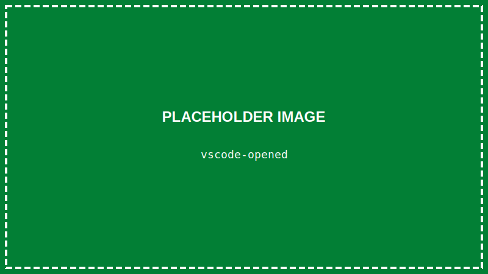
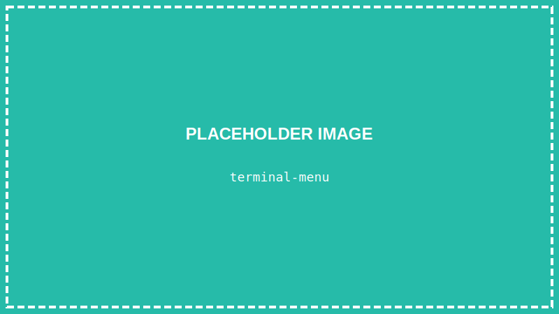
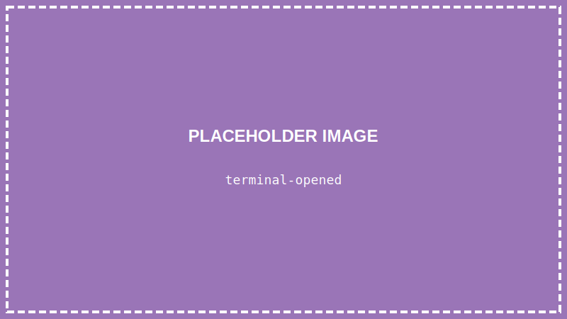
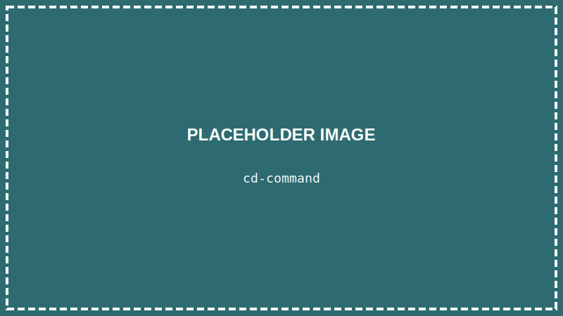

<details>
<summary>💡 AIに質問するときはここをクリック</summary>

ChatGPTやClaudeなどのAIに質問するときは、以下をコピーして最初に貼り付けてね！

```
【TypeScript講座 学習状況】
現在地: 第2回「ターミナルに触れてみよう」

■ 学習済みの内容:
- VSCodeのインストールと日本語化
- VSCodeの基本的な画面の見方

■ まだ習っていない内容:
Node.js、TypeScript、HTML、CSS、プログラミングの文法、React など

上記の学習状況を踏まえて、初心者にも分かるように答えてください。
まだ習っていない概念は使わないでください。

【質問】
ここに質問を書いてね
```

</details>

> **この回で学ぶこと**
> - ターミナルとは何か
> - VSCodeでターミナルを開く方法
> - 基本的なコマンドの使い方
> - 間違えても大丈夫ということ

---

## はじめに

前回、VSCodeをインストールしました。

今回は「**ターミナル**」というものに触れてみます。

ターミナルは、コンピュータと「文字で会話」するための道具です。最初は少し怖く感じるかもしれませんが、大丈夫。一緒にやっていきましょう。

---

## ターミナルとは？

普段、私たちはマウスでクリックしてコンピュータを操作しています。

でも、もうひとつの方法があります。それが「**文字で命令する**」方法です。

ターミナルは、その文字での命令を入力する場所です。

たとえば：
- 「今どこにいるか教えて」→ 現在のフォルダがわかる
- 「このフォルダの中身を見せて」→ ファイル一覧が表示される

プログラミングでは、このターミナルをよく使います。

---

## STEP 1: VSCodeを開く

### 1-1. VSCodeを起動する

デスクトップのVSCodeアイコンをダブルクリック、またはスタートメニューから「Visual Studio Code」を起動します。


### 1-2. VSCodeが開いた

このような画面が表示されればOKです。



---

## STEP 2: ターミナルを開く

### 2-1. メニューからターミナルを開く

画面上部のメニューから：

**「ターミナル」→「新しいターミナル」** をクリックします。



### 2-2. ターミナルが表示された

画面の下部に、ターミナルが表示されます。



> **ショートカットキー**
> 次からは `` Ctrl + ` ``（コントロール + バッククォート）でも開けます。
>
> **バッククォートの打ち方（日本語キーボード）：**
> `Shift` キーを押しながら `@` キーを押すと `` ` `` が入力できます。
> （英語キーボードの場合は、左上の「半角/全角」キーの隣にあります）

---

## STEP 3: 最初のコマンドを打ってみよう

ターミナルに文字を入力して、Enterキーを押すと「コマンド」として実行されます。

### 3-1. 今いる場所を確認する

ターミナルに以下を入力して、**Enterキー**を押してください：

```
pwd
```


すると、今いる「フォルダの場所」が表示されます。

```
/c/Users/あなたの名前
```

これは「今、あなたはこのフォルダにいますよ」という意味です。

> **pwdって何の略？**
> **P**rint **W**orking **D**irectory（現在の作業フォルダを表示）の略です。
> 「print」は「表示する」、「directory」は「フォルダ」という意味。
> 覚えなくてOK！「今どこにいるか確認するコマンド」と覚えておけば大丈夫です。

> **Windowsの場合**
> PowerShellでは `pwd` の代わりに `cd` だけでも現在地がわかります。

### 3-2. フォルダの中身を見る

次に、今いるフォルダの中身を見てみましょう：

```
ls
```


ファイルやフォルダの一覧が表示されます。

> **Windowsの場合**
> PowerShellでは `ls` も使えますが、`dir` でも同じことができます。

### 3-3. フォルダを移動する

デスクトップに移動してみましょう：

```
cd Desktop
```



`cd` は「Change Directory（ディレクトリを変える）」の略です。

> **「Desktop が見つからない」と表示されたら**
> 日本語版Windowsでは、デスクトップのフォルダ名が「デスクトップ」になっている場合があります。
> その場合は以下のコマンドを試してください：
> ```
> cd ~/Desktop
> ```
> これでうまくいかない場合は、エクスプローラーでデスクトップを開いて、アドレスバーに表示されるパスを確認してみましょう。

移動できたか確認するために、もう一度 `pwd` を入力してみてください：

```
pwd
```

```
/c/Users/あなたの名前/Desktop
```

デスクトップに移動できました！

---

## STEP 4: 元の場所に戻る

### 4-1. ひとつ上のフォルダに戻る

```
cd ..
```

`..` は「ひとつ上のフォルダ」を意味します。


---

## コマンド一覧

今回覚えたコマンドをまとめます：

| コマンド | 意味 | 覚え方 |
|---------|------|--------|
| `pwd` | 今いる場所を表示 | Print Working Directory |
| `ls` | ファイル一覧を表示 | List |
| `cd フォルダ名` | フォルダに移動 | Change Directory |
| `cd ..` | ひとつ上に戻る | - |

---

## 怖くない！間違えても大丈夫

ターミナルで間違ったコマンドを打っても、パソコンが壊れることは**ほとんどありません**。

たとえば、存在しないコマンドを打つと：

```
hello
```

```
'hello' is not recognized as a command
（helloというコマンドは認識されません）
```

このようにエラーメッセージが出るだけです。

**間違えたら、また正しいコマンドを打てばOK！** 怖がらずにどんどん試してみましょう。

---

## よくあるエラーと対処法

### 「command not found」と表示された
→ コマンドのスペルが間違っている可能性があります。もう一度確認してみてください。

### 「No such file or directory」と表示された
→ 指定したフォルダが存在しません。`ls` でフォルダ名を確認してから移動しましょう。

### 日本語が文字化けする
→ 今は気にしなくて大丈夫です。英語のフォルダ名を使うようにしましょう。

---

## まとめ

この回でやったこと：

- ✅ VSCodeを開いた
- ✅ ターミナルを開いた
- ✅ `pwd`、`ls`、`cd` コマンドを使った
- ✅ 間違えても大丈夫と学んだ

---

## 次回予告

次回は「**TypeScriptを動かす準備をしよう**」です。

Node.jsというソフトをインストールして、TypeScriptのコードを実行できるようにします。今回学んだターミナルを使いますので、復習しておいてくださいね！

---

## 練習問題（やってみよう）

1. ターミナルを開いて、`pwd` で今いる場所を確認しよう
2. `ls` で中身を見てみよう
3. `cd` でどこかのフォルダに移動して、`cd ..` で戻ってこよう

できましたか？次回も一緒に頑張りましょう！
