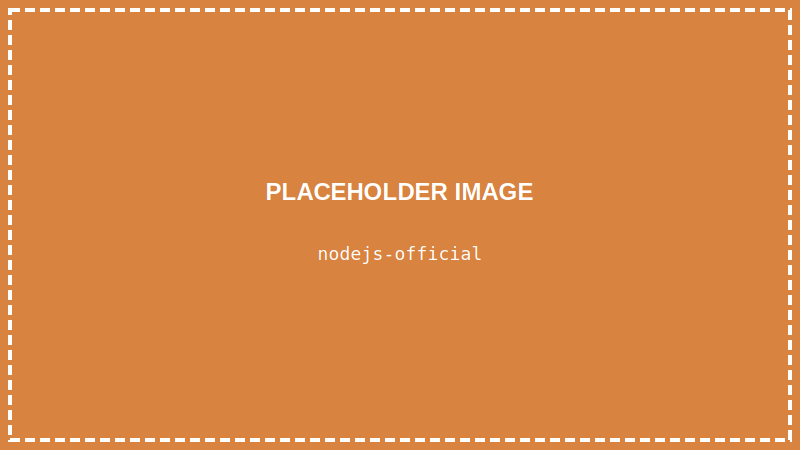
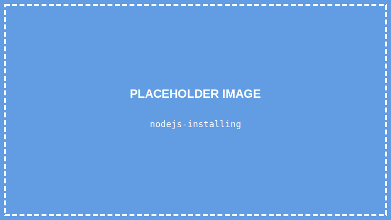
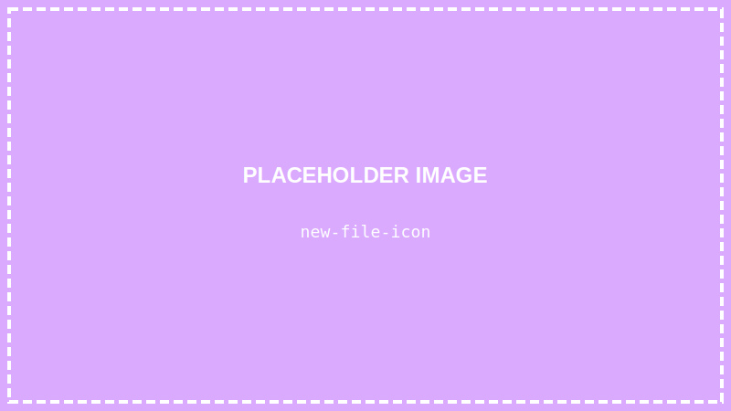
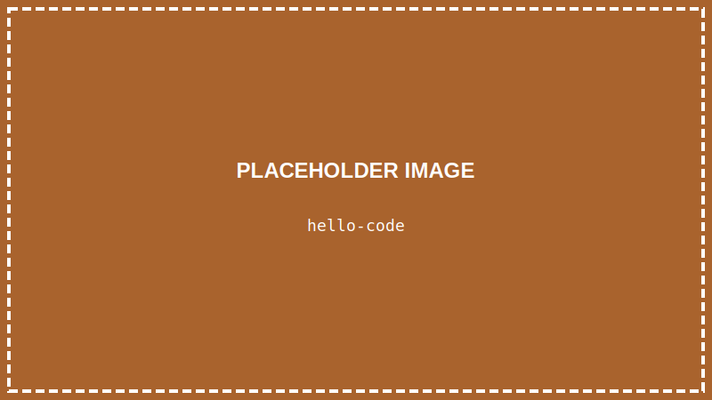
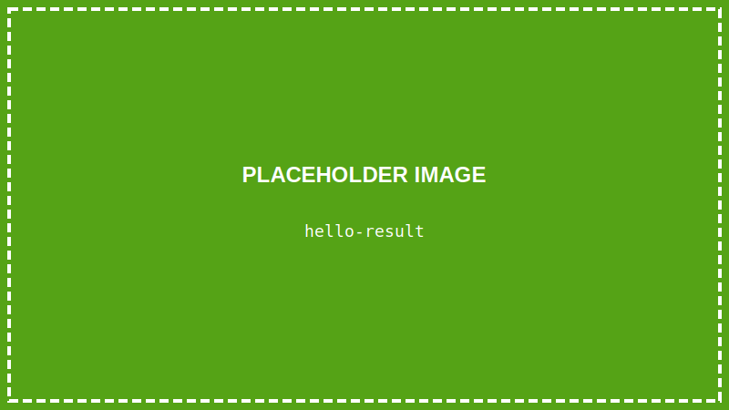

<details>
<summary>💡 AIに質問するときはここをクリック</summary>

ChatGPTやClaudeなどのAIに質問するときは、以下をコピーして最初に貼り付けてね！

```
【TypeScript講座 学習状況】
現在地: 第3回「TypeScriptを動かす準備をしよう」

■ 学習済みの内容:
- VSCodeのインストールと日本語化
- ターミナルの基本操作（pwd, ls, cd コマンド）
- フォルダとファイルの概念

■ まだ習っていない内容:
HTML、CSS、TypeScriptの文法（変数、関数など）、React など

上記の学習状況を踏まえて、初心者にも分かるように答えてください。
まだ習っていない概念は使わないでください。

【質問】
ここに質問を書いてね
```

</details>

> **この回で学ぶこと**
> - Node.jsとは何か、なぜ必要か
> - Node.jsのインストール方法
> - プロジェクトフォルダの作り方
> - 最初のプログラム「Hello World」を動かす

---

## はじめに

前回はターミナルの基本を学びました。

今回はいよいよ、**TypeScriptを動かす環境**を整えます。

少し手順が多いですが、一つずつやっていけば大丈夫です！

---

## Node.jsとは？

**Node.js**は、TypeScriptのコードを動かすために必要なソフトです。

TypeScriptは直接コンピュータが理解できる言葉ではありません。Node.jsが「翻訳」してくれることで、コンピュータがTypeScriptを実行できるようになります。

簡単に言うと：
- TypeScript = 私たちが書くプログラム
- Node.js = プログラムを動かすエンジン

---

## STEP 1: Node.jsをインストールする

### 1-1. 公式サイトにアクセスする

以下のURLにアクセスしてください：

👉 **[https://nodejs.org/](https://nodejs.org/)**



### 1-2. LTS版をダウンロードする

**「LTS」と書かれた緑のボタン**をクリックします。**v24** と表示されていることを確認してください。


> **LTSとは？**
> 「Long Term Support（長期サポート）」の略です。安定していて初心者におすすめです。

> **⚠️ 重要: Node.js 24 LTS を使ってください**
> この講座では Node.js 24 LTS 以降が必要です。Node.js 24 から TypeScript を直接実行できるようになりました。
> 古いバージョン（v22以下）では、この講座の手順通りに動かない場合があります。

### 1-3. インストーラーを実行する

ダウンロードしたファイルをダブルクリックして、インストーラーを起動します。


### 1-4. インストールを進める

「Next」をクリックしながら進めます。特に設定を変える必要はありません。



### 1-5. インストール完了

「Finish」をクリックして完了です。


---

## STEP 2: Node.jsがインストールされたか確認する

### 2-1. VSCodeを開く

デスクトップのVSCodeアイコンをダブルクリックして、VSCodeを起動します。


### 2-2. ターミナルを開く

**「ターミナル」→「新しいターミナル」** をクリック

（または `` Ctrl + ` `` を押す）


### 2-3. バージョンを確認する

ターミナルに以下を入力して、Enterキーを押します：

```
node -v
```


`v24.x.x` のようなバージョン番号が表示されれば成功です！（`x` の部分は異なっていてOK）

<details>
<summary>🔧 「node -v」でエラーが出るときは</summary>

**エラー例：**
```
'node' is not recognized as an internal or external command
```

**対処法：**
1. **パソコンを再起動**して、もう一度試してください
2. それでもダメな場合は、Node.jsを**再インストール**してください
3. インストール時に「Add to PATH」にチェックが入っているか確認

</details>

---

## STEP 3: プロジェクトフォルダを作る

プログラムを書くための専用フォルダを作りましょう。

### 3-1. フォルダを作成する場所を決める

デスクトップにフォルダを作ります。ターミナルで以下を入力：

```
cd Desktop
```

> **「Desktop が見つからない」と表示されたら**
> `cd ~/Desktop` を試してください。それでもダメな場合は、第2回の「よくあるエラーと対処法」を参照してください。

### 3-2. 新しいフォルダを作る

```
mkdir typescript-lesson
```

`mkdir` は「Make Directory（フォルダを作る）」の略です。


### 3-3. 作ったフォルダに移動する

```
cd typescript-lesson
```

### 3-4. VSCodeでフォルダを開く

```
code .
```

このコマンドで、今いるフォルダをVSCodeで開くことができます。


> **「'code' は認識されていません」と表示されたら**
> VSCodeのインストール時に「PATHに追加する」オプションがオフになっていた可能性があります。
> 以下の方法で代わりにフォルダを開けます：
> 1. VSCodeを手動で起動
> 2. **「ファイル」→「フォルダーを開く」** をクリック
> 3. デスクトップの `typescript-lesson` フォルダを選択して「フォルダーの選択」をクリック

> **新しいウィンドウについて**
> `code .` コマンドを実行すると、**新しいVSCodeのウィンドウ**が開きます。
> 最初のVSCodeウィンドウ（ターミナルを開いていたもの）は閉じてOKです。
> **以降は、この新しく開いたウィンドウで作業します。**

---

## STEP 4: Hello Worldを作る

いよいよ最初のプログラムを書きます！

### 4-1. 新しいウィンドウでターミナルを開く

新しく開いたVSCodeで、ターミナルを開きます。

**「ターミナル」→「新しいターミナル」** をクリック

### 4-2. 新しいファイルを作る

VSCodeの左側を見てください。「**エクスプローラー**」という名前のサイドバーがあります（Windowsの「エクスプローラー」とは別物です。VSCodeのファイル一覧表示のことです）。

フォルダ名（`TYPESCRIPT-LESSON`）にマウスを合わせると、小さなアイコンが表示されます。
左から1番目の **ファイルに＋マークがついたアイコン**が「**新しいファイル**」ボタンです。これをクリックします。



> **アイコンが見つからない場合**
> フォルダ名（`TYPESCRIPT-LESSON`）の文字の上にマウスカーソルを**しっかり乗せて**ください。
> アイコンはマウスを乗せないと表示されません。

### 4-3. ファイル名を入力する

ファイル名を `hello.ts` と入力して、Enterキーを押します。


> **`.ts` とは？**
> ファイル名の最後についている `.ts` の部分を「**拡張子（かくちょうし）**」と呼びます。
> 拡張子は「このファイルは何の種類か」を表しています。
> - `.ts` → TypeScriptファイル
> - `.html` → HTMLファイル
> - `.txt` → テキストファイル

### 4-4. コードを書く

開いた `hello.ts` ファイルに、以下のコードを入力します：

```typescript
console.log("Hello, World!");
```



### 4-5. ファイルを保存する

**`Ctrl + S`** を押して、ファイルを保存します。


> **保存のサイン**
> ファイル名の横に**白い丸（●）**があると「未保存」です。
> 保存すると丸が消えます。**コードを変更したら必ず保存しましょう！**

---

## STEP 5: プログラムを実行する

### 5-1. ターミナルでプログラムを実行する

ターミナルに以下を入力して、Enterキーを押します：

```
node hello.ts
```


> **Node.js 24 から TypeScript が直接実行できる！**
> 以前は `ts-node` というツールが必要でしたが、Node.js 24 からは `node` コマンドだけで TypeScript ファイルを実行できるようになりました。

### 5-2. 結果を確認する

```
Hello, World!
```

ターミナルに「Hello, World!」と表示されたら**成功です！**



**おめでとうございます！** あなたは今、最初のTypeScriptプログラムを動かしました！

<details>
<summary>🔧 「node hello.ts」でエラーが出るときは</summary>

**エラー例①：ファイルが見つからない**
```
Cannot find module '/path/to/hello.ts'
```
→ ファイル名のスペルを確認してください（`hello.ts`、大文字小文字も注意）
→ 正しいフォルダにいるか確認（`ls` コマンドで `hello.ts` が表示されるか）

**エラー例②：構文エラー**
```
SyntaxError: Unexpected token
```
→ コードを見直してください。特に以下をチェック：
  - `"` や `)` が閉じられているか
  - セミコロン `;` が抜けていないか
  - 全角スペースが混じっていないか

**エラー例③：Node.js のバージョンが古い**
```
SyntaxError: Missing initializer in const declaration
```
→ Node.js 24 以上が必要です。`node -v` でバージョンを確認してください。
→ v24 未満の場合は、Node.js 公式サイトから最新の LTS 版をインストールしてください。

**「Hello, World!」が表示されない**
1. ファイルを**保存したか**確認してください（`Ctrl + S`）
2. ファイル名が `hello.ts` になっているか確認
3. ターミナルが正しいフォルダにいるか確認（`ls` で `hello.ts` が見えるか）

</details>

---

## コマンド一覧

今回覚えたコマンドをまとめます：

| コマンド | 意味 |
|---------|------|
| `node -v` | Node.jsのバージョン確認 |
| `mkdir フォルダ名` | 新しいフォルダを作る |
| `code .` | 現在のフォルダをVSCodeで開く |
| `node ファイル名.ts` | TypeScriptファイルを実行 |

---

## 【補足】TypeScriptの実行方法は2種類ある

この講座では、場面によって異なる方法でTypeScriptを実行します。
今は覚えなくて大丈夫ですが、「あれ？さっきと違う？」と思ったときに見返してください。

| 方法 | コマンド | 使う場面 | 特徴 |
|------|---------|---------|------|
| **node** | `node ファイル.ts` | ターミナルで動かす（第3〜12回） | 手軽。ブラウザでは使えない |
| **Vite** | `npm run dev` | ブラウザで動かす / Reactで開発（第13回〜） | 自動でコンパイル＆更新。一番便利 |

**なぜ違うの？**
- **ターミナル**で動かすときは、Node.js 24 が TypeScript を直接実行できる
- **ブラウザ**で動かすときは、ブラウザがTypeScriptを理解できないので、Viteが自動で変換してくれる

> 💡 **最初は「そういうものか」でOK！**
> 細かい仕組みは気にせず、講座の指示通りにコマンドを打てば大丈夫です。

---

## まとめ

この回でやったこと：

- ✅ Node.js 24 LTS をインストールした
- ✅ プロジェクトフォルダを作った
- ✅ 最初のプログラム「Hello, World!」を動かした

---

## 次回予告

次回は「**Webページの骨組みを作ろう（HTML基礎）**」です。

TypeScriptの前に、まずはWebページの作り方を学びます。HTMLというマークアップ言語を使って、簡単なWebページを作ってみましょう！
