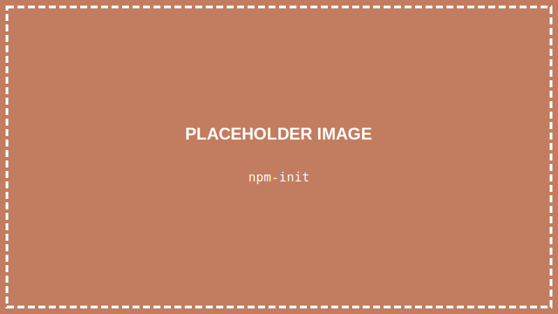

<details>
<summary>💡 AIに質問するときはここをクリック</summary>

ChatGPTやClaudeなどのAIに質問するときは、以下をコピーして最初に貼り付けてね！

```
【TypeScript講座 学習状況】
現在地: 第3回「TypeScriptを動かす準備をしよう」

■ 学習済みの内容:
- VSCodeのインストールと日本語化
- ターミナルの基本操作（pwd, ls, cd コマンド）
- フォルダとファイルの概念

■ まだ習っていない内容:
HTML、CSS、TypeScriptの文法（変数、関数など）、React など

上記の学習状況を踏まえて、初心者にも分かるように答えてください。
まだ習っていない概念は使わないでください。

【質問】
ここに質問を書いてね
```

</details>

> **この回で学ぶこと**
> - Node.jsとは何か、なぜ必要か
> - Node.jsのインストール方法
> - プロジェクトフォルダの作り方
> - TypeScriptのインストール方法
> - 最初のプログラム「Hello World」を動かす

---

## はじめに

前回はターミナルの基本を学びました。

今回はいよいよ、**TypeScriptを動かす環境**を整えます。

少し手順が多いですが、一つずつやっていけば大丈夫です！

---

## Node.jsとは？

**Node.js**は、TypeScriptのコードを動かすために必要なソフトです。

TypeScriptは直接コンピュータが理解できる言葉ではありません。Node.jsが「翻訳」してくれることで、コンピュータがTypeScriptを実行できるようになります。

簡単に言うと：
- TypeScript = 私たちが書くプログラム
- Node.js = プログラムを動かすエンジン

---

## STEP 1: Node.jsをインストールする

### 1-1. 公式サイトにアクセスする

以下のURLにアクセスしてください：

👉 **https://nodejs.org/**


### 1-2. LTS版をダウンロードする

**「LTS」と書かれた緑のボタン**をクリックします。


> **LTSとは？**
> 「Long Term Support（長期サポート）」の略です。安定していて初心者におすすめです。

### 1-3. インストーラーを実行する

ダウンロードしたファイルをダブルクリックして、インストーラーを起動します。


### 1-4. インストールを進める

「Next」をクリックしながら進めます。特に設定を変える必要はありません。


### 1-5. インストール完了

「Finish」をクリックして完了です。


---

## STEP 2: Node.jsがインストールされたか確認する

### 2-1. VSCodeを開く

デスクトップのVSCodeアイコンをダブルクリックして、VSCodeを起動します。


### 2-2. ターミナルを開く

**「ターミナル」→「新しいターミナル」** をクリック

（または `` Ctrl + ` `` を押す）


### 2-3. バージョンを確認する

ターミナルに以下を入力して、Enterキーを押します：

```
node -v
```


`v20.11.0` のようなバージョン番号が表示されれば成功です！

> **エラーが出た場合**
> 「'node' is not recognized」のようなエラーが出たら、VSCodeを一度閉じて、パソコンを再起動してから、もう一度試してください。

---

## STEP 3: プロジェクトフォルダを作る

プログラムを書くための専用フォルダを作りましょう。

### 3-1. フォルダを作成する場所を決める

デスクトップにフォルダを作ります。ターミナルで以下を入力：

```
cd Desktop
```

> **「Desktop が見つからない」と表示されたら**
> `cd ~/Desktop` を試してください。それでもダメな場合は、第2回の「よくあるエラーと対処法」を参照してください。

### 3-2. 新しいフォルダを作る

```
mkdir typescript-lesson
```

`mkdir` は「Make Directory（フォルダを作る）」の略です。


### 3-3. 作ったフォルダに移動する

```
cd typescript-lesson
```

### 3-4. VSCodeでフォルダを開く

```
code .
```

このコマンドで、今いるフォルダをVSCodeで開くことができます。


> **「'code' は認識されていません」と表示されたら**
> VSCodeのインストール時に「PATHに追加する」オプションがオフになっていた可能性があります。
> 以下の方法で代わりにフォルダを開けます：
> 1. VSCodeを手動で起動
> 2. **「ファイル」→「フォルダーを開く」** をクリック
> 3. デスクトップの `typescript-lesson` フォルダを選択して「フォルダーの選択」をクリック

> **新しいウィンドウについて**
> `code .` コマンドを実行すると、**新しいVSCodeのウィンドウ**が開きます。
> 最初のVSCodeウィンドウ（ターミナルを開いていたもの）は閉じてOKです。
> **以降は、この新しく開いたウィンドウで作業します。**

---

## STEP 4: TypeScriptをインストールする

### 4-1. 新しいウィンドウでターミナルを開く

新しく開いたVSCodeで、ターミナルを開きます。

**「ターミナル」→「新しいターミナル」** をクリック

### 4-2. プロジェクトを初期化する

```
npm init -y
```



`package.json` というファイルが作成されます。これはプロジェクトの設定ファイルです。

> **`-y` って何？**
> 「全部デフォルトでOK」という意味です。`-y` をつけないと、プロジェクト名などを1つずつ聞かれますが、今は気にしなくてOKです。

### 4-3. TypeScriptをインストールする

```
npm install typescript ts-node
```


> **パッケージとは？**
> 誰かが作った便利なプログラムの「部品」のことです。
> `npm install` で、インターネットからパッケージをダウンロードしてインストールできます。
> ここでは `typescript` と `ts-node` という2つのパッケージをインストールしています。

少し時間がかかることがあります。終わるまで待ちましょう。

### 4-4. インストール完了

以下のような表示が出れば成功です：

```
added 19 packages in 5s
```

---

## STEP 5: Hello Worldを作る

いよいよ最初のプログラムを書きます！

### 5-1. 新しいファイルを作る

VSCodeの左側を見てください。「**エクスプローラー**」という名前のサイドバーがあります（Windowsの「エクスプローラー」とは別物です。VSCodeのファイル一覧表示のことです）。

フォルダ名（`TYPESCRIPT-LESSON`）にマウスを合わせると、小さなアイコンが表示されます。
左から1番目の **ファイルに＋マークがついたアイコン**が「**新しいファイル**」ボタンです。これをクリックします。


> **アイコンが見つからない場合**
> フォルダ名（`TYPESCRIPT-LESSON`）の文字の上にマウスカーソルを**しっかり乗せて**ください。
> アイコンはマウスを乗せないと表示されません。

### 5-2. ファイル名を入力する

ファイル名を `hello.ts` と入力して、Enterキーを押します。


> **`.ts` とは？**
> ファイル名の最後についている `.ts` の部分を「**拡張子（かくちょうし）**」と呼びます。
> 拡張子は「このファイルは何の種類か」を表しています。
> - `.ts` → TypeScriptファイル
> - `.html` → HTMLファイル
> - `.txt` → テキストファイル

### 5-3. コードを書く

開いた `hello.ts` ファイルに、以下のコードを入力します：

```typescript
console.log("Hello, World!");
```


### 5-4. ファイルを保存する

**`Ctrl + S`** を押して、ファイルを保存します。


> **保存のサイン**
> ファイル名の横に**白い丸（●）**があると「未保存」です。
> 保存すると丸が消えます。**コードを変更したら必ず保存しましょう！**

---

## STEP 6: プログラムを実行する

### 6-1. ターミナルでプログラムを実行する

ターミナルに以下を入力して、Enterキーを押します：

```
npx ts-node hello.ts
```


> **`npm` と `npx` の違いは？**
> - `npm install` → パッケージを**インストール**する
> - `npx` → インストールしたパッケージを**実行**する
>
> 簡単に言うと、`npm` は「ダウンロード係」、`npx` は「実行係」です。

### 6-2. 結果を確認する

```
Hello, World!
```

ターミナルに「Hello, World!」と表示されたら**成功です！**


**おめでとうございます！** あなたは今、最初のTypeScriptプログラムを動かしました！

---

## コマンド一覧

今回覚えたコマンドをまとめます：

| コマンド | 意味 |
|---------|------|
| `node -v` | Node.jsのバージョン確認 |
| `mkdir フォルダ名` | 新しいフォルダを作る |
| `code .` | 現在のフォルダをVSCodeで開く |
| `npm init -y` | プロジェクトを初期化 |
| `npm install パッケージ名` | パッケージをインストール |
| `npx ts-node ファイル名` | TypeScriptファイルを実行 |

---

## まとめ

この回でやったこと：

- ✅ Node.jsをインストールした
- ✅ プロジェクトフォルダを作った
- ✅ TypeScriptをインストールした
- ✅ 最初のプログラム「Hello, World!」を動かした

---

## 次回予告

次回は「**Webページの骨組みを作ろう（HTML基礎）**」です。

TypeScriptの前に、まずはWebページの作り方を学びます。HTMLというマークアップ言語を使って、簡単なWebページを作ってみましょう！

---

## 困ったときは

### 「node -v」でエラーが出る
→ パソコンを再起動して、もう一度試してください

### 「npm install」が途中で止まる
→ インターネット接続を確認してください。時間がかかることもあるので、しばらく待ってみましょう

### 「Hello, World!」が表示されない
→ ファイルを保存したか確認してください（`Ctrl + S`）
→ ファイル名が `hello.ts` になっているか確認してください
