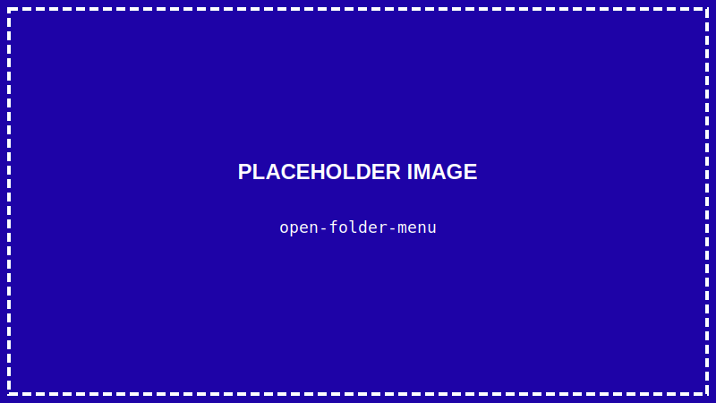
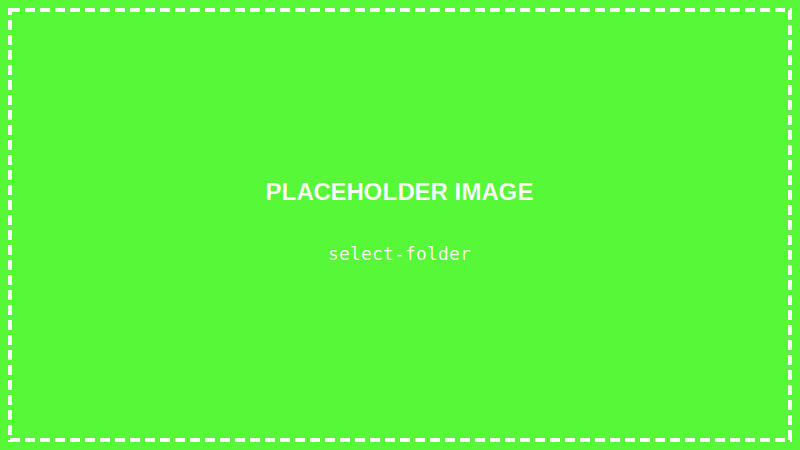
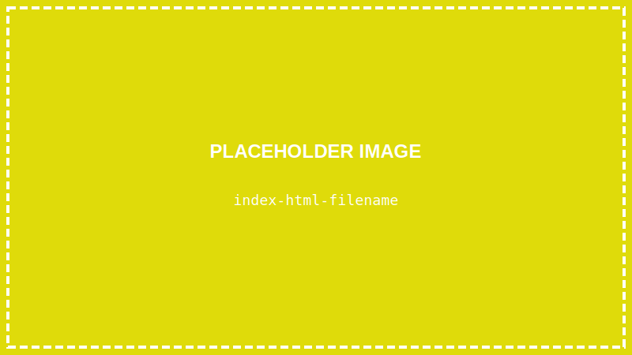
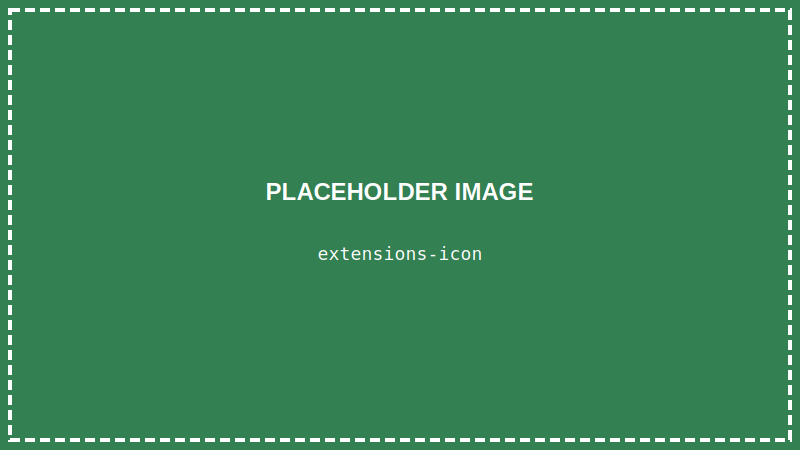
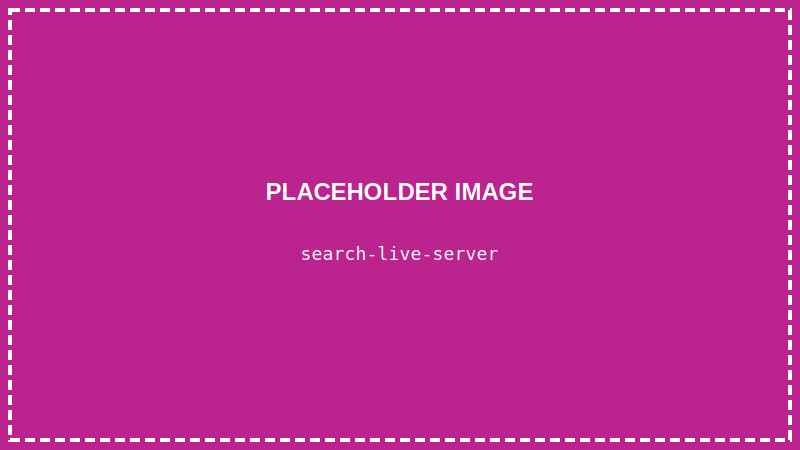
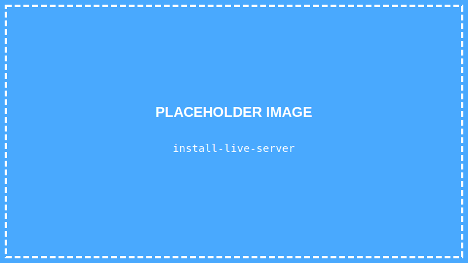
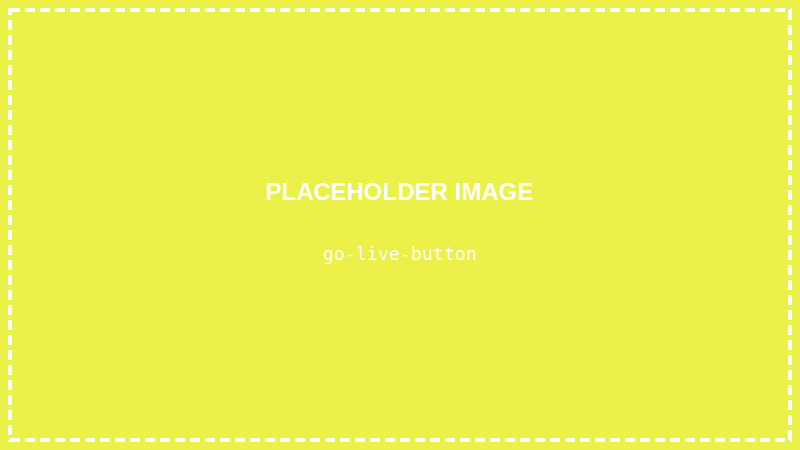
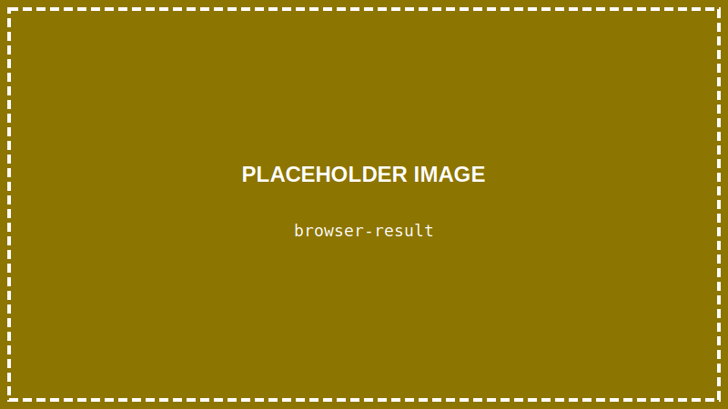
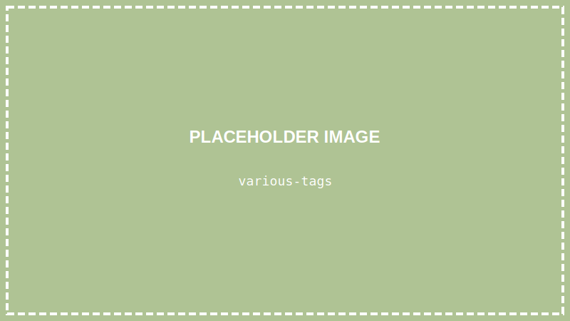

<details>
<summary>💡 AIに質問するときはここをクリック</summary>

ChatGPTやClaudeなどのAIに質問するときは、以下をコピーして最初に貼り付けてね！

```
【TypeScript講座 学習状況】
現在地: 第4回「Webページの骨組みを作ろう（HTML基礎）」

■ 学習済みの内容:
- VSCodeの使い方（ファイル作成、保存）
- ターミナルの基本操作（pwd, ls, cd, mkdir）
- Node.jsのインストール
- TypeScriptのインストール（npm install）
- 最初のプログラム「Hello World」の実行（npx ts-node）

■ まだ習っていない内容:
CSS、TypeScriptの文法（変数、関数、if文など）、DOM操作、React など

上記の学習状況を踏まえて、初心者にも分かるように答えてください。
まだ習っていない概念は使わないでください。

【質問】
ここに質問を書いてね
```

</details>

> **この回で学ぶこと**
> - Webページがどうやってできているか
> - HTMLとは何か
> - よく使うHTMLタグ
> - ブラウザで表示する方法

---

## はじめに

前回、TypeScriptを動かす準備ができました。

でも、いきなりTypeScriptでゲームを作る前に、まずは**Webページの作り方**を学びましょう。

Webページは **HTML** という言語で作られています。

---

## Webページはどうやってできている？

普段見ているWebページは、実は3つの言語でできています：

| 言語 | 役割 | 例え |
|-----|------|------|
| **HTML** | 骨組み・内容 | 家の骨格 |
| **CSS** | 見た目・装飾 | 壁紙や家具 |
| **JavaScript/TypeScript** | 動き・機能 | 電気や水道 |

今回は、この中の **HTML** を学びます。

---

## STEP 1: VSCodeでプロジェクトを開く

### 1-1. VSCodeを起動する

デスクトップのVSCodeアイコンをダブルクリックして、VSCodeを起動します。

### 1-2. プロジェクトフォルダを開く

前回作った `typescript-lesson` フォルダを開きます。

**「ファイル」→「フォルダーを開く」** をクリック



デスクトップにある `typescript-lesson` フォルダを選択して、「フォルダーの選択」をクリック



---

## STEP 2: HTMLファイルを作る

### 2-1. 新しいファイルを作る

VSCodeの左側を見てください。「**エクスプローラー**」というサイドバーがあります（Windowsの「エクスプローラー」とは別物です）。

フォルダ名にマウスを合わせると表示される「**新しいファイル**」アイコン（ファイルに＋マーク）をクリック


### 2-2. ファイル名を入力する

`index.html` と入力して、Enterキーを押します。



> **なぜ index.html？**
> Webサイトのトップページは慣習的に `index.html` という名前にします。

---

## STEP 3: HTMLの基本構造を書く

### 3-1. 基本構造を入力する

`index.html` に以下のコードを入力します：

```html
<!DOCTYPE html>
<html lang="ja">
<head>
    <meta charset="UTF-8">
    <title>はじめてのWebページ</title>
</head>
<body>
    <h1>こんにちは！</h1>
    <p>これは私の最初のWebページです。</p>
</body>
</html>
```


### 3-2. ファイルを保存する

**`Ctrl + S`** を押して、ファイルを保存します。

---

## STEP 4: HTMLの構造を理解する

今書いたコードを解説します：

```html
<!DOCTYPE html>
```
→ 「これはHTMLファイルです」と宣言

```html
<html lang="ja">
```
→ HTMLの始まり。`lang="ja"` は日本語のページという意味

```html
<head>
    ...
</head>
```
→ ページの設定情報を書く場所（画面には表示されない）

```html
<body>
    ...
</body>
```
→ **実際に画面に表示される内容**を書く場所

```html
</html>
```
→ HTMLの終わり

---

## STEP 5: ブラウザで表示してみよう

### 5-1. Live Server拡張機能をインストールする

HTMLをブラウザで簡単に表示するために、便利な拡張機能をインストールします。

画面左側の「**拡張機能**」アイコン（四角が4つ）をクリック



### 5-2. Live Serverを検索する

検索ボックスに `Live Server` と入力



### 5-3. インストールする

「**Live Server**」を見つけて「**Install**」をクリック



### 5-4. ブラウザで表示する

`index.html` ファイルを開いた状態で、VSCode画面の**右下**を見てください。

青いバー（ステータスバー）に「**Go Live**」と書かれた部分があります。これをクリックします。



> **「Go Live」が見つからない場合**
> - ステータスバー（画面一番下の青いバー）の**右側**を探してください
> - Live Serverのインストールが完了しているか確認してください
> - VSCodeを一度閉じて、再度開いてみてください

### 5-5. ブラウザで確認する

ブラウザが自動で開き、作ったページが表示されます！



**おめでとうございます！** 最初のWebページが完成しました！

---

## STEP 6: よく使うHTMLタグを覚えよう

HTMLはいろいろな「**タグ**」を使って内容を書きます。

`index.html` の `<body>` の中身を以下のように書き換えてみましょう：

```html
<body>
    <h1>自己紹介</h1>

    <h2>名前</h2>
    <p>山田太郎です。</p>

    <h2>趣味</h2>
    <p>私の趣味は以下のとおりです：</p>
    <ul>
        <li>ゲーム</li>
        <li>読書</li>
        <li>プログラミング</li>
    </ul>

    <h2>リンク</h2>
    <p>私の好きなサイト：</p>
    <a href="https://www.google.com">Google</a>

    <h2>写真</h2>
    

    <h2>ボタン</h2>
    <button>クリックしてね</button>
</body>
```

**`Ctrl + S`** で保存すると、ブラウザが自動で更新されます。



---

## よく使うHTMLタグ一覧

| タグ | 意味 | 例 |
|-----|------|-----|
| `<h1>`〜`<h6>` | 見出し（h1が一番大きい） | `<h1>タイトル</h1>` |
| `<p>` | 段落（文章のかたまり） | `<p>文章です</p>` |
| `<ul>` | 箇条書きリスト | `<ul><li>項目</li></ul>` |
| `<ol>` | 番号付きリスト | `<ol><li>項目</li></ol>` |
| `<li>` | リストの項目 | `<li>項目</li>` |
| `<a>` | リンク | `<a href="URL">テキスト</a>` |
| `` | 画像 | `` |
| `<button>` | ボタン | `<button>押す</button>` |
| `<div>` | グループ分け | `<div>内容</div>` |

---

## タグのルール

### 開始タグと終了タグ

ほとんどのタグは、**開始タグ**と**終了タグ**のペアで使います：

```html
<p>ここに文章</p>
↑開始タグ    ↑終了タグ（/がつく）
```

### 閉じタグがないタグ

一部のタグは終了タグがありません：

```html

<br>  （改行）
```

### 入れ子にできる

タグの中にタグを入れることができます：

```html
<ul>
    <li>項目1</li>
    <li>項目2</li>
</ul>
```

---

## まとめ

この回でやったこと：

- ✅ VSCodeでプロジェクトを開いた
- ✅ HTMLファイルを作成した
- ✅ HTMLの基本構造を学んだ
- ✅ Live Serverでブラウザ表示した
- ✅ よく使うHTMLタグを覚えた

---

## 次回予告

次回は「**ページを装飾しよう（CSS基礎）**」です。

今回作ったページは、まだ白黒で味気ないですね。CSSを使って、色をつけたり、見た目をきれいにしていきます！

---

## 練習問題（やってみよう）

1. 自分の名前と趣味を書いた自己紹介ページを作ってみよう
2. `<h2>` と `<h3>` を使って、見出しの大きさの違いを確認しよう
3. `<ol>` を使って、番号付きリストを作ってみよう

保存（`Ctrl + S`）を忘れずに！
