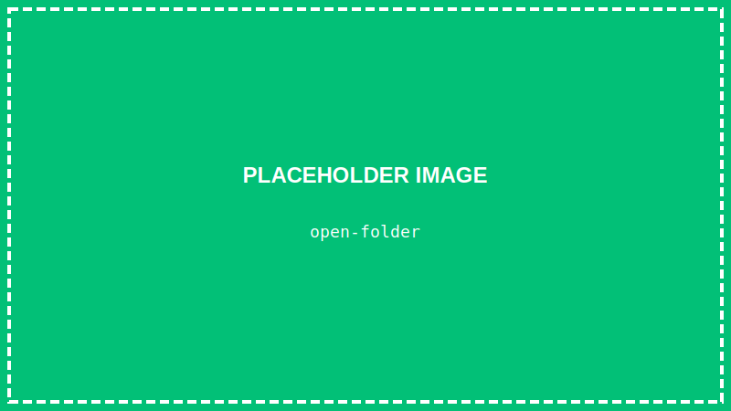
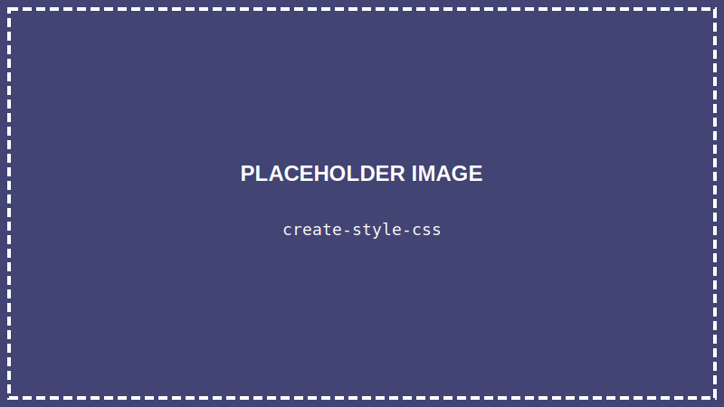
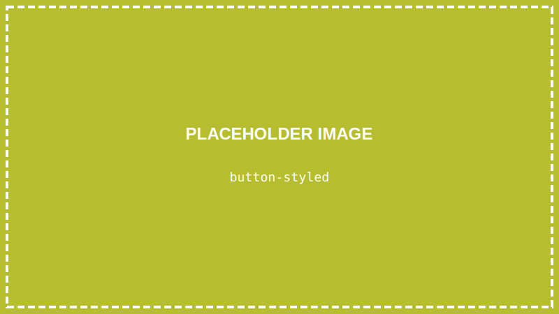
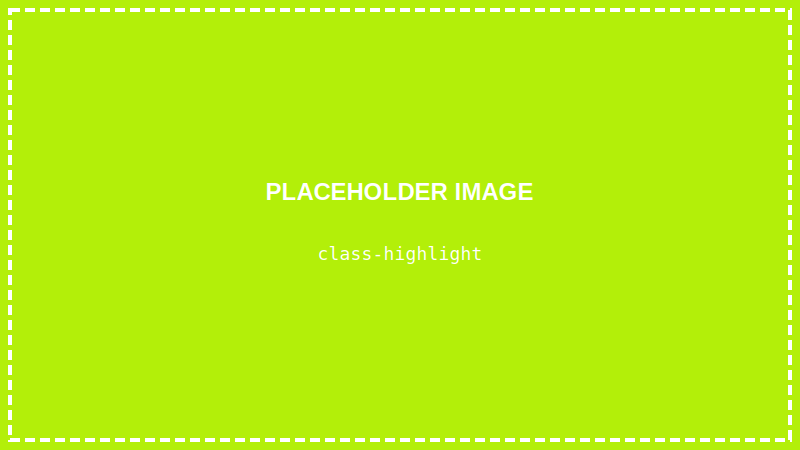

<details>
<summary>💡 AIに質問するときはここをクリック</summary>

ChatGPTやClaudeなどのAIに質問するときは、以下をコピーして最初に貼り付けてね！

```
【TypeScript講座 学習状況】
現在地: 第5回「ページを装飾しよう（CSS基礎）」

■ 学習済みの内容:
- VSCodeの使い方（ファイル作成、保存、Live Server）
- ターミナルの基本操作
- Node.js、TypeScriptのセットアップ
- HTMLの基本構造（<!DOCTYPE html>, <html>, <head>, <body>）
- HTMLタグ（h1〜h6, p, ul, ol, li, a, img, button, div）
- ブラウザでの表示確認（Live Server）

■ まだ習っていない内容:
Flexbox、TypeScriptの文法（変数、関数、if文など）、DOM操作、React など

上記の学習状況を踏まえて、初心者にも分かるように答えてください。
まだ習っていない概念は使わないでください。

【質問】
ここに質問を書いてね
```

</details>

> **この回で学ぶこと**
> - CSSとは何か
> - CSSの書き方
> - 文字や背景の色を変える方法
> - 余白や枠線の付け方
> - クラスとIDの使い方

---

## はじめに

前回、HTMLでWebページの骨組みを作りました。

でも、白黒で味気ないですよね？

今回は **CSS** を使って、ページを**カラフルに装飾**していきます。

---

## CSSとは？

**CSS（Cascading Style Sheets）** は、HTMLの見た目を整えるための言語です。

- 文字の色を変える
- 背景色をつける
- 余白を調整する
- レイアウトを整える

こういったことがCSSでできます。

---

## STEP 1: VSCodeでプロジェクトを開く

### 1-1. VSCodeを起動する

デスクトップのVSCodeアイコンをダブルクリックして、VSCodeを起動します。

### 1-2. プロジェクトフォルダを開く

**「ファイル」→「フォルダーを開く」** から、`typescript-lesson` フォルダを開きます。



### 1-3. 前回のファイルを確認する

VSCode左側のエクスプローラー（ファイル一覧）に `index.html` があることを確認します。

---

## STEP 2: CSSファイルを作る

### 2-1. 新しいファイルを作る

フォルダ名にマウスを合わせて、「**新しいファイル**」アイコン（ファイルに＋マーク）をクリックし、`style.css` と入力します。



### 2-2. CSSをHTMLに読み込む

`index.html` を開いて、`<head>` の中に以下の1行を追加します：

```html
<head>
    <meta charset="UTF-8">
    <title>はじめてのWebページ</title>
    <link rel="stylesheet" href="style.css">  <!-- この行を追加 -->
</head>
```

> **`<link rel="stylesheet" href="...">` とは？**
> この1行で「CSSファイルを読み込んでね」とブラウザに伝えています。
> - `rel="stylesheet"` → 「これはスタイルシート（CSS）ですよ」という意味
> - `href="style.css"` → 読み込むファイル名（さっき作った `style.css`）
>
> これを書かないと、CSSファイルがあっても反映されません。

### 2-3. 保存する

**`Ctrl + S`** で `index.html` を保存します。

---

## STEP 3: 最初のCSSを書いてみよう

### 3-1. style.cssを開く

左側のエクスプローラーで `style.css` をクリックして開きます。

### 3-2. CSSを書く

以下のコードを入力します：

```css
h1 {
    color: blue;
}
```

### 3-3. 保存してブラウザで確認

**`Ctrl + S`** で保存します。

Live Serverでブラウザを開いていれば、**自動で更新**されます。

まだ開いていなければ、画面右下のステータスバー（青いバー）にある「**Go Live**」をクリック。
（見つからない場合は、第4回の「Go Liveが見つからない場合」を参照してください）


`<h1>` の文字が**青色**になりました！

---

## STEP 4: CSSの書き方を理解する

CSSは以下の形式で書きます：

```css
セレクタ {
    プロパティ: 値;
}
```

さっき書いたコードを分解すると：

```css
h1 {           /* ← セレクタ（どの要素に適用するか） */
    color: blue;   /* ← プロパティ: 値（何をどうするか） */
}
```

- **セレクタ**: `h1` → すべての `<h1>` タグが対象
- **プロパティ**: `color` → 文字の色
- **値**: `blue` → 青色

---

## STEP 5: いろいろなスタイルを試そう

`style.css` を以下のように書き換えましょう：

```css
/* 見出しのスタイル */
h1 {
    color: darkblue;
    background-color: lightyellow;
}

/* 段落のスタイル */
p {
    color: #333333;
    font-size: 18px;
}

/* リストのスタイル */
ul {
    background-color: #f0f0f0;
}

/* リンクのスタイル */
a {
    color: green;
}

/* ボタンのスタイル */
button {
    background-color: orange;
    color: white;
    font-size: 16px;
}
```

**`Ctrl + S`** で保存して、ブラウザで確認してみましょう。


---

## よく使うCSSプロパティ

### 文字関連

| プロパティ | 意味 | 例 |
|-----------|------|-----|
| `color` | 文字の色 | `color: red;` |
| `font-size` | 文字の大きさ | `font-size: 20px;` |
| `font-weight` | 文字の太さ | `font-weight: bold;` |
| `text-align` | 文字の揃え | `text-align: center;` |

### 背景関連

| プロパティ | 意味 | 例 |
|-----------|------|-----|
| `background-color` | 背景色 | `background-color: yellow;` |

> **💡 色の指定方法**
>
> 色は3通りの方法で指定できます：
>
> 1. **色の名前**（英語）: `red`, `blue`, `green`, `orange` など
> 2. **16進数**（#から始まる）: `#ff0000`（赤）, `#333333`（濃いグレー）
> 3. **RGB**: `rgb(255, 0, 0)`（赤）
>
> **16進数って何？**
> `#333333` のような書き方を「16進数カラーコード」と言います。
> - `#` の後に6文字（0〜9とa〜fを使う）
> - 最初の2文字が**赤**、次が**緑**、最後が**青**の明るさ
> - `00` が最も暗く、`ff` が最も明るい
>
> **覚えなくてOK！** 色を選ぶときは「css color picker」で検索すると、好きな色のコードを調べられます。

### 余白関連

| プロパティ | 意味 | 例 |
|-----------|------|-----|
| `margin` | 外側の余白 | `margin: 20px;` |
| `padding` | 内側の余白 | `padding: 10px;` |

### 枠線関連

| プロパティ | 意味 | 例 |
|-----------|------|-----|
| `border` | 枠線 | `border: 2px solid black;` |
| `border-radius` | 角を丸く | `border-radius: 10px;` |

---

## STEP 6: 余白と枠線を使ってみよう

`style.css` に以下を追加しましょう：

```css
/* ボタンに余白と枠線 */
button {
    background-color: orange;
    color: white;
    font-size: 16px;
    padding: 10px 20px;      /* 内側の余白 */
    border: none;            /* 枠線なし */
    border-radius: 5px;      /* 角を少し丸く */
    margin: 10px;            /* 外側の余白 */
}
```

**`Ctrl + S`** で保存して確認してみましょう。



ボタンがおしゃれになりました！

---

## STEP 7: クラスを使ってみよう

今までは `h1` や `p` など、タグ名でスタイルを指定していました。

でも、「この `<p>` だけ赤くしたい」という場合はどうすればいいでしょう？

そこで使うのが **クラス** です。

### 7-1. HTMLにクラスを追加する

`index.html` の `<body>` を編集します：

```html
<body>
    <h1>自己紹介</h1>

    <p>普通の段落です。</p>
    <p class="highlight">強調したい段落です。</p>
    <p>また普通の段落です。</p>
</body>
```

`class="highlight"` を追加しました。

**`Ctrl + S`** で保存します。

### 7-2. CSSでクラスにスタイルを適用する

`style.css` に以下を追加：

```css
/* クラス名の前にドット（.）をつける */
.highlight {
    color: red;
    background-color: lightyellow;
    font-weight: bold;
}
```

**`Ctrl + S`** で保存して確認。



`class="highlight"` をつけた段落だけ、赤く強調されました！

---

## クラスとIDの違い

| | クラス | ID |
|--|-------|-----|
| 書き方（HTML） | `class="名前"` | `id="名前"` |
| 書き方（CSS） | `.名前` | `#名前` |
| 使える回数 | 何度でも使える | ページ内で1回だけ |

基本的には **クラス** をよく使います。

---

## 色の指定方法

CSSで色を指定する方法は3つあります：

### 1. 色の名前

```css
color: red;
color: blue;
color: orange;
```

### 2. 16進数（HEXコード）

```css
color: #ff0000;  /* 赤 */
color: #0000ff;  /* 青 */
color: #333333;  /* 濃いグレー */
```

### 3. RGB

```css
color: rgb(255, 0, 0);    /* 赤 */
color: rgb(0, 0, 255);    /* 青 */
color: rgb(51, 51, 51);   /* 濃いグレー */
```

どれを使っても大丈夫です。最初は色の名前が簡単でおすすめです。

---

## まとめ

この回でやったこと：

- ✅ CSSファイルを作成した
- ✅ HTMLにCSSを読み込んだ
- ✅ 文字の色、背景色を変えた
- ✅ 余白（margin, padding）と枠線（border）を使った
- ✅ クラスでスタイルを指定した

---

## 次回予告

次回は「**【作品①】自己紹介ページを完成させよう**」です。

今はすべての要素が**縦に並んでいる**だけですね。次回は **Flexbox** を使って横に並べたり、中央に配置したりして、自己紹介ページを完成させます！

---

## 練習問題（やってみよう）

1. `<h2>` のスタイルを追加してみよう（色やサイズを変えてみる）
2. クラス `.box` を作って、背景色・余白・枠線を設定してみよう
3. ボタンの色を自分の好きな色に変えてみよう

保存（`Ctrl + S`）を忘れずに！
