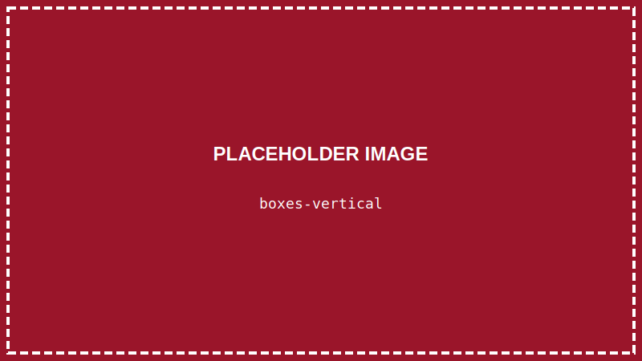
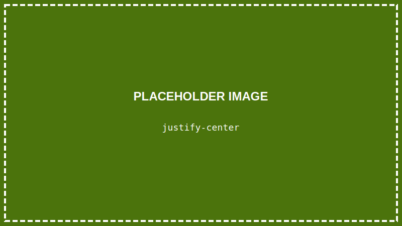
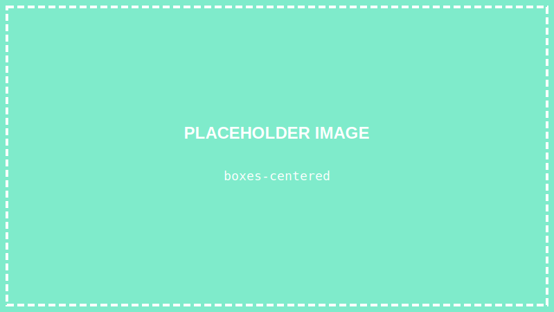

<details>
<summary>💡 AIに質問するときはここをクリック</summary>

ChatGPTやClaudeなどのAIに質問するときは、以下をコピーして最初に貼り付けてね！

```
【TypeScript講座 学習状況】
現在地: 第6回「【作品①】自己紹介ページを完成させよう」

■ 学習済みの内容:
- VSCodeの使い方、ターミナルの基本操作
- Node.js、TypeScriptのセットアップ
- HTMLの基本（タグ、構造、よく使うタグ）
- CSSの基本:
  - セレクタ（タグ名、.クラス、#ID）
  - 色の指定（color, background-color）
  - 文字のスタイル（font-size, font-weight, text-align）
  - 余白（margin, padding）
  - 枠線（border, border-radius）

■ まだ習っていない内容:
TypeScriptの文法（変数、関数、if文など）、DOM操作、イベント処理、React など

上記の学習状況を踏まえて、初心者にも分かるように答えてください。
まだ習っていない概念は使わないでください。

【質問】
ここに質問を書いてね
```

</details>

> **この回で学ぶこと**
> - なぜレイアウトが必要か
> - Flexboxとは何か
> - 要素を横並びにする方法
> - 要素を中央に配置する方法
> - 【作品①】自己紹介ページを完成させる

---

## はじめに

前回、CSSで色や余白を設定できるようになりました。

でも、今のページは全部**縦に並んでいる**だけ。

今回は **Flexbox** を使って、要素を**横に並べたり**、**中央に配置したり**できるようになりましょう！

---

## なぜレイアウトが必要？

Webページの要素（文字、画像、ボタンなど）は、何もしないと**上から下に縦に並びます**。

でも、実際のWebサイトを見てみると：
- ナビゲーションメニューが**横に並んでいる**
- コンテンツが**中央に配置**されている
- カードが**3つ横並び**になっている

こういったレイアウトを実現するのが **Flexbox** です。

---

## STEP 1: VSCodeでプロジェクトを開く

### 1-1. VSCodeを起動する

デスクトップのVSCodeアイコンをダブルクリックして、VSCodeを起動します。

### 1-2. プロジェクトフォルダを開く

**「ファイル」→「フォルダーを開く」** から、`typescript-lesson` フォルダを開きます。

---

## STEP 2: 練習用のHTMLを作る

### 2-1. HTMLを書き換える

`index.html` の `<body>` を以下のように書き換えます：

```html
<body>
    <div class="container">
        <div class="box">ボックス1</div>
        <div class="box">ボックス2</div>
        <div class="box">ボックス3</div>
    </div>
</body>
```

**`Ctrl + S`** で保存します。

### 2-2. CSSで基本スタイルを設定

`style.css` を以下のように書き換えます：

```css
.container {
    background-color: lightgray;
    padding: 20px;
}

.box {
    background-color: steelblue;
    color: white;
    padding: 20px;
    margin: 5px;
}
```

**`Ctrl + S`** で保存して、ブラウザで確認。



3つのボックスが**縦に並んでいます**ね。

---

## STEP 3: Flexboxで横並びにする

### 3-1. display: flex を追加する

`style.css` の `.container` に1行追加します：

```css
.container {
    background-color: lightgray;
    padding: 20px;
    display: flex;  /* この行を追加！ */
}
```

**`Ctrl + S`** で保存して確認。


たった1行で**横並び**になりました！

これが **Flexbox** の力です。

---

## STEP 4: Flexboxのプロパティを覚えよう

Flexboxには便利なプロパティがたくさんあります。

### justify-content（横方向の配置）

横方向の位置を調整します。

```css
.container {
    display: flex;
    justify-content: center;  /* 中央に配置 */
}
```



よく使う値：

| 値 | 効果 |
|----|------|
| `flex-start` | 左寄せ（デフォルト） |
| `center` | 中央 |
| `flex-end` | 右寄せ |
| `space-between` | 両端に配置、間隔均等 |
| `space-around` | 均等に配置（両端にも余白） |

### align-items（縦方向の配置）

縦方向の位置を調整します。

```css
.container {
    display: flex;
    align-items: center;  /* 縦方向に中央 */
    height: 200px;        /* 高さを指定しないと効果がわかりにくい */
}
```

よく使う値：

| 値 | 効果 |
|----|------|
| `flex-start` | 上寄せ |
| `center` | 中央 |
| `flex-end` | 下寄せ |

### flex-direction（並ぶ方向）

並ぶ方向を変えられます。

```css
.container {
    display: flex;
    flex-direction: column;  /* 縦方向に並べる */
}
```

| 値 | 効果 |
|----|------|
| `row` | 横方向（デフォルト） |
| `column` | 縦方向 |

### gap（要素の間隔）

Flexboxの子要素同士の間隔を設定します。

```css
.container {
    display: flex;
    gap: 20px;  /* 子要素の間隔を20pxに */
}
```

> **💡 gap を使わない場合**
> `gap` を使わない場合は、各要素に `margin` を指定して間隔を作ります。
> `gap` のほうが簡単で、余計な余白が端にできないのでおすすめです。

---

## STEP 5: 中央配置を試そう

ページのど真ん中にボックスを配置してみましょう。

`style.css` を以下のように書き換えます：

```css
.container {
    background-color: lightgray;
    padding: 20px;
    height: 300px;

    display: flex;
    justify-content: center;  /* 横方向に中央 */
    align-items: center;      /* 縦方向に中央 */
}

.box {
    background-color: steelblue;
    color: white;
    padding: 30px;
    margin: 10px;
}
```

**`Ctrl + S`** で保存して確認。



ボックスが**縦横中央**に配置されました！

---

## STEP 6: 【作品①】自己紹介ページを完成させよう

学んだことを使って、自己紹介ページを作りましょう！

### 6-1. HTMLを作成する

`index.html` の `<body>` を以下のように書き換えます：

```html
<body>
    <div class="page">
        <!-- ヘッダー -->
        <header class="header">
            <h1>山田太郎のページ</h1>
        </header>

        <!-- メインコンテンツ -->
        <main class="main">
            <!-- プロフィールカード -->
            <div class="profile-card">
                
                <h2>山田 太郎</h2>
                <p class="profile-text">高校2年生。プログラミング勉強中！</p>
            </div>

            <!-- 趣味セクション -->
            <div class="section">
                <h2>趣味</h2>
                <div class="hobby-list">
                    <div class="hobby-item">🎮 ゲーム</div>
                    <div class="hobby-item">📚 読書</div>
                    <div class="hobby-item">💻 プログラミング</div>
                </div>
            </div>

            <!-- スキルセクション -->
            <div class="section">
                <h2>学んでいること</h2>
                <ul>
                    <li>HTML / CSS</li>
                    <li>TypeScript</li>
                    <li>これからReactも！</li>
                </ul>
            </div>
        </main>

        <!-- フッター -->
        <footer class="footer">
            <p>&copy; 2024 山田太郎</p>
        </footer>
    </div>
</body>
```

**`Ctrl + S`** で保存します。

> **💡 絵文字の入力方法**
> 趣味のところで使っている絵文字（🎮📚💻）は、以下の方法で入力できます：
> - **Windows**: `Windows + .`（ピリオド）を同時押し
> - **Mac**: `Ctrl + Cmd + スペース`
>
> 絵文字パネルが開くので、好きな絵文字を選んでクリック！

### 6-2. CSSを作成する

`style.css` を以下のように書き換えます：

```css
/* ページ全体 */
body {
    margin: 0;
    font-family: sans-serif;
    background-color: #f5f5f5;
}

.page {
    max-width: 800px;
    margin: 0 auto;
    background-color: white;
    min-height: 100vh;
}

/* ヘッダー */
.header {
    background-color: #4a90d9;
    color: white;
    padding: 20px;
    text-align: center;
}

.header h1 {
    margin: 0;
}

/* メインコンテンツ */
.main {
    padding: 20px;
}

/* プロフィールカード */
.profile-card {
    background-color: #fff;
    border: 1px solid #ddd;
    border-radius: 10px;
    padding: 30px;
    text-align: center;
    margin-bottom: 20px;
}

.profile-image {
    border-radius: 50%;
    width: 150px;
    height: 150px;
}

.profile-card h2 {
    margin: 15px 0 10px 0;
}

.profile-text {
    color: #666;
}

/* セクション */
.section {
    background-color: #fff;
    border: 1px solid #ddd;
    border-radius: 10px;
    padding: 20px;
    margin-bottom: 20px;
}

.section h2 {
    margin-top: 0;
    color: #4a90d9;
}

/* 趣味リスト（Flexboxで横並び！） */
.hobby-list {
    display: flex;
    justify-content: center;
    gap: 15px;  /* 要素同士の間隔 */
}

.hobby-item {
    background-color: #e8f4fd;
    padding: 15px 25px;
    border-radius: 20px;
    font-size: 16px;
}

/* フッター */
.footer {
    background-color: #333;
    color: white;
    text-align: center;
    padding: 15px;
}
```

**`Ctrl + S`** で保存して、ブラウザで確認。


---

## 【作品①完成！】

おめでとうございます！ 最初の作品「自己紹介ページ」が完成しました！

ポイントを振り返りましょう：

- **Flexbox** で趣味を横並びにした
- **border-radius** で角を丸くした
- **text-align: center** で中央揃えにした
- **max-width** と **margin: 0 auto** でページを中央に配置した

---

## まとめ

この回でやったこと：

- ✅ Flexboxの基本を学んだ
- ✅ `justify-content` で横方向の配置を調整した
- ✅ `align-items` で縦方向の配置を調整した
- ✅ 【作品①】自己紹介ページを完成させた

---

## 次回予告

次回からは、いよいよ **TypeScript** に入ります！

「**データを入れる箱を使おう（変数と型）**」で、プログラミングの基本を学んでいきましょう。

---

## 練習問題（やってみよう）

1. 自分の名前と趣味に書き換えてみよう
2. 色を自分の好きな色に変えてみよう
3. 趣味を4つ以上に増やしてみよう（Flexboxで自動的に並びます！）

保存（`Ctrl + S`）を忘れずに！
