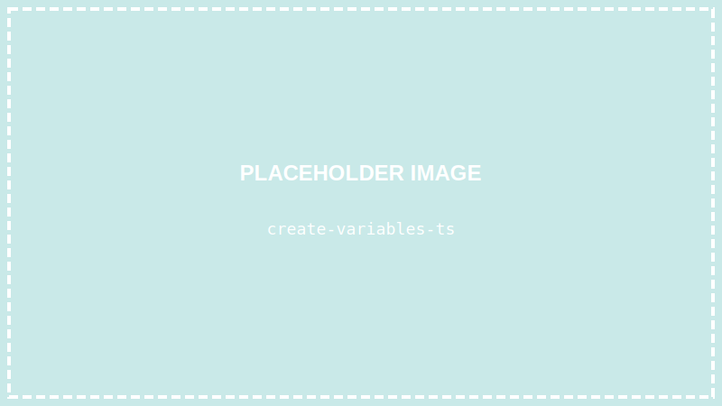
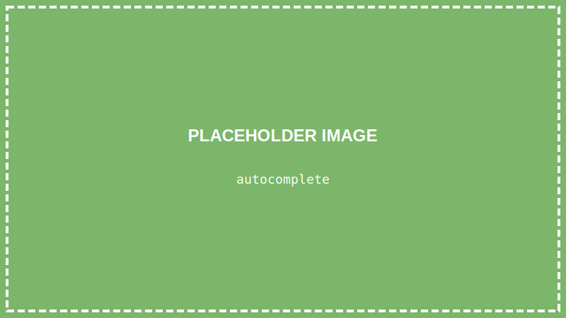

<details>
<summary>💡 AIに質問するときはここをクリック</summary>

ChatGPTやClaudeなどのAIに質問するときは、以下をコピーして最初に貼り付けてね！

```
【TypeScript講座 学習状況】
現在地: 第7回「データを入れる箱を使おう（変数と型）」

■ 学習済みの内容:
- VSCode、ターミナル、Node.js/TypeScriptのセットアップ
- HTMLの基本（タグ、構造）
- CSSの基本（色、余白、枠線、クラス、ID）
- Flexbox（display: flex, justify-content, align-items）
- 【作品①】自己紹介ページを作成済み

■ まだ習っていない内容:
TypeScriptの文法（if文、関数、配列など）、DOM操作、イベント処理、React など
※ 今回から変数と型を学び始めます

上記の学習状況を踏まえて、初心者にも分かるように答えてください。
まだ習っていない概念は使わないでください。

【質問】
ここに質問を書いてね
```

</details>

> **この回で学ぶこと**
> - 変数とは何か
> - letとconstの違い
> - TypeScriptの「型」とは何か
> - string、number、boolean の使い方
> - なぜ型があると便利なのか

---

## はじめに

前回まででHTML/CSSを学び、自己紹介ページを作りました。

今回からは、いよいよ **TypeScript** を学んでいきます！

まずは「**変数**」と「**型**」という、プログラミングの基本中の基本を学びましょう。

---

## STEP 1: VSCodeでプロジェクトを開く

### 1-1. VSCodeを起動する

デスクトップのVSCodeアイコンをダブルクリックして、VSCodeを起動します。

### 1-2. プロジェクトフォルダを開く

**「ファイル」→「フォルダーを開く」** から、`typescript-lesson` フォルダを開きます。

### 1-3. ターミナルを開く

**「ターミナル」→「新しいターミナル」** をクリック

---

## STEP 2: 新しいTypeScriptファイルを作る

### 2-1. ファイルを作成する

左側の「新しいファイル」アイコンをクリックして、`variables.ts` と入力します。



---

## 変数とは？

**変数**とは、データを入れておく「**箱**」のようなものです。

箱には名前をつけて、中にデータを入れることができます。

```
[名前の箱] → "山田太郎"
[年齢の箱] → 16
[学生かどうかの箱] → はい
```

プログラミングでは、このような「箱」を使ってデータを管理します。

---

## STEP 3: 変数を作ってみよう

### 3-1. letで変数を作る

`variables.ts` に以下を入力します：

```typescript
let name = "山田太郎";
console.log(name);
```

**`Ctrl + S`** で保存します。

### 3-2. プログラムを実行する

ターミナルで以下を入力してEnter：

```
npx ts-node variables.ts
```

結果：
```
山田太郎
```

「山田太郎」と表示されました！

### 3-3. コードを理解する

```typescript
let name = "山田太郎";
```

- `let` → 「変数を作ります」という宣言
- `name` → 変数の名前（箱の名前）
- `=` → 「代入する」という意味
- `"山田太郎"` → 箱に入れるデータ

```typescript
console.log(name);
```

- `console.log()` → カッコの中身を画面に表示する
- `name` → 変数の中身を取り出す

---

## STEP 4: 変数の値を変更する

`let` で作った変数は、後から値を変えられます。

```typescript
let name = "山田太郎";
console.log(name);  // 山田太郎

name = "佐藤花子";  // 値を変更
console.log(name);  // 佐藤花子
```

**`Ctrl + S`** で保存して、実行してみましょう：

```
npx ts-node variables.ts
```

結果：
```
山田太郎
佐藤花子
```

値が変わりました！

---

## STEP 5: constを使ってみよう

`const` で作った変数は、値を**変更できません**。

```typescript
const PI = 3.14159;
console.log(PI);  // 3.14159

PI = 3;  // エラー！ constは変更できない
```

`Ctrl + S` で保存すると、VSCodeがエラーを教えてくれます。


> **letとconstの使い分け**
> - `const`: 値を変えない場合（ほとんどの場合こちら）
> - `let`: 値を変える必要がある場合

---

## STEP 6: TypeScriptの「型」を学ぼう

TypeScriptの特徴は「**型**」があることです。

型とは、「この箱には何を入れていいか」を決めるルールです。

### 基本の3つの型

| 型 | 意味 | 例 |
|----|------|-----|
| `string` | 文字列 | "こんにちは", "山田太郎" |
| `number` | 数値 | 42, 3.14, -10 |
| `boolean` | 真偽値（はい/いいえ） | true, false |

### 型を明示的に書く

```typescript
let name: string = "山田太郎";
let age: number = 16;
let isStudent: boolean = true;

console.log(name);      // 山田太郎
console.log(age);       // 16
console.log(isStudent); // true
```

`: string` の部分を「**型注釈**」と呼びます。

---

## STEP 7: 型があると何がうれしい？

### 間違いを防いでくれる

例えば、数値を入れるべき変数に文字列を入れようとすると…

```typescript
let age: number = 16;
age = "十六歳";  // エラー！ numberにstringは入れられない
```

VSCodeが**赤い波線**でエラーを教えてくれます。


### 入力補完が効く

変数の型がわかっていると、VSCodeが「使えるもの」を教えてくれます。



これが **TypeScript** の強みです！

---

## STEP 8: 実践してみよう

`variables.ts` を以下のように書き換えて、自分の情報を入れてみましょう：

```typescript
// 自分の情報を変数に入れる
const myName: string = "山田太郎";
const myAge: number = 16;
const isStudent: boolean = true;
const hobby: string = "プログラミング";

// 表示する
console.log("=== 自己紹介 ===");
console.log("名前: " + myName);
console.log("年齢: " + myAge + "歳");
console.log("学生: " + isStudent);
console.log("趣味: " + hobby);
```

**`Ctrl + S`** で保存して、実行：

```
npx ts-node variables.ts
```

結果：
```
=== 自己紹介 ===
名前: 山田太郎
年齢: 16歳
学生: true
趣味: プログラミング
```

---

## 文字列の連結

`+` を使うと、文字列同士をくっつけられます：

```typescript
const firstName: string = "太郎";
const lastName: string = "山田";

const fullName: string = lastName + firstName;
console.log(fullName);  // 山田太郎
```

数値も文字列と `+` すると、文字列になります：

```typescript
const age: number = 16;
console.log("年齢: " + age + "歳");  // 年齢: 16歳
```

---

## テンプレートリテラル（便利な書き方）

バッククォート `` ` `` を使うと、もっと読みやすく書けます。

> **バッククォートの打ち方（日本語キーボード）**
> `Shift` キーを押しながら `@` キーを押すと `` ` `` が入力できます。

```typescript
const name: string = "山田太郎";
const age: number = 16;

// + で連結する書き方
console.log("私の名前は" + name + "、" + age + "歳です");

// テンプレートリテラル（こっちが便利！）
console.log(`私の名前は${name}、${age}歳です`);
```

`${}` の中に変数を入れると、その値が埋め込まれます。

---

## まとめ

この回でやったこと：

- ✅ 変数とは「データを入れる箱」
- ✅ `let` は変更できる、`const` は変更できない
- ✅ TypeScriptには「型」がある
- ✅ `string`（文字列）、`number`（数値）、`boolean`（真偽値）
- ✅ 型があると間違いを防げる

---

## 次回予告

次回は「**条件によって処理を変えよう（if文）**」です。

「もし〜なら〜する」という、条件分岐を学びます。おみくじプログラムも作りますよ！

---

## 練習問題（やってみよう）

1. 自分の情報（名前、年齢、趣味など）を変数に入れて表示してみよう
2. `const` で作った変数を変更しようとして、エラーを確認しよう
3. テンプレートリテラルを使って、文章を作ってみよう

保存（`Ctrl + S`）を忘れずに！
