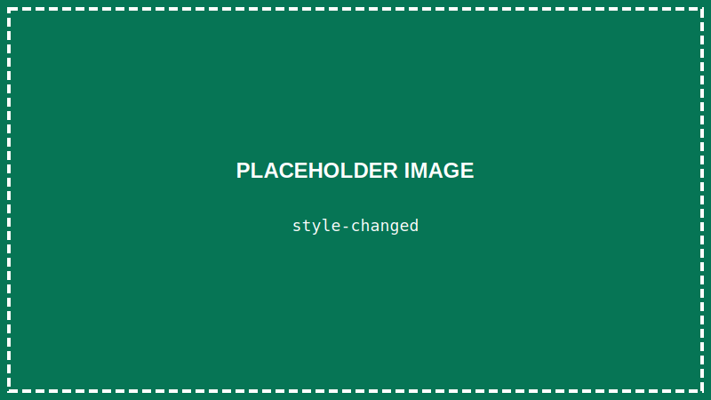

<details>
<summary>💡 AIに質問するときはここをクリック</summary>

ChatGPTやClaudeなどのAIに質問するときは、以下をコピーして最初に貼り付けてね！

```
【TypeScript講座 学習状況】
現在地: 第13回「HTMLをTypeScriptで操作しよう（DOM基礎）」

■ 学習済みの内容:
- VSCode、ターミナル、Node.js/TypeScript環境
- HTML/CSSの基本、Flexbox
- TypeScriptの基礎:
  - 変数と型（let, const, string, number, boolean）
  - if文、比較演算子、論理演算子
  - 関数（引数、戻り値、アロー関数）
  - 配列（作成、アクセス、メソッド、ループ）
- 【作品①】自己紹介ページ
- おみくじプログラム
- 【作品②】じゃんけんゲーム（コンソール版）

■ まだ習っていない内容:
オブジェクト、イベント処理（クリックなど）、React など
※ 今回からブラウザで動くプログラムを作り始めます

上記の学習状況を踏まえて、初心者にも分かるように答えてください。
まだ習っていない概念は使わないでください。

【質問】
ここに質問を書いてね
```

</details>

> **この回で学ぶこと**
> - DOMとは何か
> - TypeScriptからHTML要素を取得する方法
> - 要素の中身を変更する方法
> - 要素のスタイルを変更する方法

---

## はじめに

前回まで、TypeScriptのコードはターミナルで実行していました。

今回からは、**ブラウザで動くプログラム**を作っていきます！

TypeScriptからHTMLを操作する「**DOM操作**」を学びましょう。

> **🔄 ここから変わること**
>
> | | 今まで（第3〜12回） | これから（第13〜16回） |
> |--|-------------------|---------------------|
> | **実行場所** | ターミナル | ブラウザ |
> | **コマンド** | `npx ts-node ファイル名.ts` | `npx tsc ファイル名.ts` |
> | **結果確認** | ターミナルに表示 | ブラウザで確認 |
>
> 今までは「ターミナルに文字を出すだけ」でしたが、これからは「画面にボタンを作って、クリックしたら反応する」といったことができるようになります！
>
> **なぜ `tsc` を使う？**
> ブラウザはTypeScriptを直接読めないので、JavaScriptに変換（コンパイル）する必要があります。
> `tsc` は TypeScript Compiler（コンパイラ）の略です。

---

## DOMとは？

**DOM（Document Object Model）** とは、HTMLをプログラムから操作するための仕組みです。

ブラウザは、HTMLを読み込むと「DOMツリー」という構造を作ります。

```
html
├── head
│   └── title
└── body
    ├── h1
    └── p
```

TypeScriptは、このDOMツリーを操作できます。

---

## STEP 1: VSCodeでプロジェクトを開く

### 1-1. VSCodeを起動する

デスクトップのVSCodeアイコンをダブルクリックして、VSCodeを起動します。

### 1-2. プロジェクトフォルダを開く

**「ファイル」→「フォルダーを開く」** から、`typescript-lesson` フォルダを開きます。

---

## STEP 2: ファイルを準備する

DOM操作を学ぶためのHTMLとTypeScriptファイルを作ります。

### 2-1. HTMLファイルを作成

新しいファイル `dom-practice.html` を作成します：

```html
<!DOCTYPE html>
<html lang="ja">
<head>
    <meta charset="UTF-8">
    <title>DOM操作の練習</title>
    <style>
        body {
            font-family: sans-serif;
            padding: 20px;
        }
        .box {
            padding: 20px;
            margin: 10px 0;
            border: 1px solid #ccc;
        }
        button {
            padding: 10px 20px;
            font-size: 16px;
            margin: 5px;
        }
    </style>
</head>
<body>
    <h1 id="title">DOMの練習</h1>

    <div class="box">
        <p id="message">ここにメッセージが表示されます</p>
    </div>

    <div class="box">
        <button id="btn-change">テキストを変更</button>
        <button id="btn-color">色を変更</button>
    </div>

    <script src="dom-practice.js"></script>
</body>
</html>
```

**`Ctrl + S`** で保存します。

### 2-2. TypeScriptファイルを作成

新しいファイル `dom-practice.ts` を作成します：

```typescript
console.log("TypeScriptファイルが読み込まれました！");
```

**`Ctrl + S`** で保存します。

---

## STEP 3: TypeScriptをコンパイルする

ブラウザはTypeScriptを直接実行できません。**JavaScript** に変換（コンパイル）する必要があります。

### 3-1. ターミナルを開く

**「ターミナル」→「新しいターミナル」** をクリック

### 3-2. コンパイルする

```
npx tsc dom-practice.ts
```

`dom-practice.js` というファイルが生成されます。


> **毎回コンパイルが必要？**
> はい、TypeScriptファイルを変更したら、毎回 `npx tsc ファイル名` でコンパイルしてからブラウザを更新する必要があります。
> 少し面倒ですが、Reactを使うようになると（第17回以降）、自動でコンパイルされるようになります。

> **なぜ `ts-node` じゃなくて `tsc` なの？**
> - `ts-node`：ターミナル（Node.js）で動かすときに使う
> - `tsc`：ブラウザで動かすときに使う（JSファイルに変換）
>
> ブラウザはTypeScriptを直接理解できないので、JavaScriptに変換する必要があります。
> 詳しくは第3回の「TypeScriptの実行方法は3種類ある」を見てください。

---

## STEP 4: ブラウザで確認する

### 4-1. Live Serverで開く

`dom-practice.html` を開いた状態で、右下の「**Go Live**」をクリック

### 4-2. コンソールを確認する

ブラウザで **F12キー** を押して、開発者ツールを開きます。

「**Console**」タブをクリック。


「TypeScriptファイルが読み込まれました！」と表示されていれば成功です！

---

## STEP 5: 要素を取得する

### getElementById

`id` 属性で要素を取得します。

`dom-practice.ts` を書き換えます：

```typescript
// id="title" の要素を取得
const titleElement = document.getElementById("title");

console.log(titleElement);
```

**`Ctrl + S`** で保存 → コンパイル：

```
npx tsc dom-practice.ts
```

ブラウザを更新（F5）して、コンソールを確認。

```
<h1 id="title">DOMの練習</h1>
```

HTMLの要素が取得できました！

### querySelector（おすすめ）

CSSセレクタで要素を取得できます：

```typescript
// id で取得（# をつける）
const titleElement = document.querySelector("#title");

// class で取得（. をつける）
const boxElement = document.querySelector(".box");

// タグ名で取得
const h1Element = document.querySelector("h1");
```

> **なぜ querySelector がおすすめ？**
> - **CSSと同じ書き方**で要素を指定できる（`#id`、`.class` など）
> - id でもclass でもタグ名でも、**同じメソッド**で取得できる
> - 第5回で学んだCSSセレクタの知識がそのまま使える
>
> `getElementById` は id 専用、`getElementsByClassName` は class 専用…と覚えるより、`querySelector` ひとつを覚えるほうが簡単です。

---

## STEP 6: 要素の中身を変更する

### textContent

`dom-practice.ts` を書き換えます：

```typescript
// 要素を取得
const messageElement = document.querySelector("#message");

// 中身を変更
if (messageElement) {
    messageElement.textContent = "TypeScriptから変更しました！";
}
```

**`Ctrl + S`** → コンパイル → ブラウザ更新


> **なぜ if で囲む？**
> `querySelector` は要素が見つからないと `null` を返します。
> TypeScriptは `null` の可能性があると警告するので、`if` で確認します。

### innerHTML

HTMLタグを含む内容を設定できます：

```typescript
if (messageElement) {
    messageElement.innerHTML = "<strong>太字</strong>のテキスト";
}
```

---

## STEP 7: 要素のスタイルを変更する

`style` プロパティでCSSを変更できます：

```typescript
const titleElement = document.querySelector("#title") as HTMLElement;

if (titleElement) {
    titleElement.style.color = "blue";
    titleElement.style.backgroundColor = "lightyellow";
    titleElement.style.padding = "10px";
}
```

**`Ctrl + S`** → コンパイル → ブラウザ更新



> **`as HTMLElement` とは？**
> `style` を使うときに必要なおまじないです。
> `querySelector` で取得した要素に `style` を設定するときは、この書き方をすると覚えておいてください。
> （詳しく言うと「この要素はHTMLElementだよ」とTypeScriptに教えているのですが、今は気にしなくてOKです）

---

## STEP 8: 実践してみよう

学んだことを組み合わせて、`dom-practice.ts` を完成させましょう：

```typescript
// 要素を取得
const titleElement = document.querySelector("#title") as HTMLElement;
const messageElement = document.querySelector("#message") as HTMLElement;

// ページ読み込み時の処理
console.log("ページが読み込まれました");

// タイトルの色を変更
if (titleElement) {
    titleElement.style.color = "darkblue";
}

// メッセージを変更
if (messageElement) {
    messageElement.textContent = "DOMを使ってHTMLを操作できるようになりました！";
    messageElement.style.fontSize = "20px";
    messageElement.style.color = "green";
}

// 現在の時刻を表示する関数
function showCurrentTime(): void {
    const now = new Date();
    const timeString = `${now.getHours()}:${now.getMinutes()}:${now.getSeconds()}`;

    if (messageElement) {
        messageElement.textContent = `現在の時刻: ${timeString}`;
    }
}

// 3秒後に時刻を表示
setTimeout(() => {
    showCurrentTime();
}, 3000);
```

**`Ctrl + S`** → コンパイル → ブラウザ更新

3秒後に現在時刻が表示されます！

---

## よく使うDOMプロパティ・メソッド

| プロパティ/メソッド | 説明 |
|-------------------|------|
| `textContent` | テキスト内容を取得・設定 |
| `innerHTML` | HTML内容を取得・設定 |
| `style.xxx` | スタイルを設定 |
| `classList.add()` | クラスを追加 |
| `classList.remove()` | クラスを削除 |
| `getAttribute()` | 属性を取得 |
| `setAttribute()` | 属性を設定 |

---

## まとめ

この回でやったこと：

- ✅ DOMとは「HTMLをプログラムから操作する仕組み」
- ✅ `querySelector` で要素を取得
- ✅ `textContent` で中身を変更
- ✅ `style` でスタイルを変更
- ✅ TypeScriptをコンパイルしてブラウザで実行

---

## 次回予告

次回は「**ユーザーの操作に反応しよう（イベント処理）**」です。

ボタンをクリックしたら何かが起きる、入力したら反応する…そんな**インタラクティブな処理**を学びます！

---

## 練習問題（やってみよう）

1. `<h1>` のテキストを自分の名前に変更してみよう
2. 背景色を好きな色に変えてみよう
3. 新しい `<p>` 要素を追加して、スタイルを設定してみよう

コンパイル（`npx tsc ファイル名`）と保存（`Ctrl + S`）を忘れずに！

<details>
<summary>💡 解答例を見る</summary>

```typescript
// 1. 自分の名前に変更
const titleElement = document.querySelector("#title") as HTMLElement;
if (titleElement) {
    titleElement.textContent = "田中花子のページ";
}

// 2. 背景色を変える
const boxElement = document.querySelector(".box") as HTMLElement;
if (boxElement) {
    boxElement.style.backgroundColor = "lightpink";
}

// 3. 新しい要素にスタイルを設定
const messageElement = document.querySelector("#message") as HTMLElement;
if (messageElement) {
    messageElement.textContent = "DOM操作を練習中！";
    messageElement.style.fontSize = "24px";
    messageElement.style.color = "purple";
    messageElement.style.fontWeight = "bold";
}
```

</details>

---

## 困ったときは（よくあるエラーと対処法）

### コンパイルでエラーが出る

**エラー例①：ファイルが見つからない**
```
error TS6053: File 'dom-practice.ts' not found.
```
→ ファイル名のスペルを確認してください
→ ターミナルが正しいフォルダにいるか確認（`ls` で確認）

**エラー例②：型エラー**
```
Property 'style' does not exist on type 'Element'
```
→ `as HTMLElement` を付け忘れていませんか？
```typescript
// ❌ エラーになる
const el = document.querySelector("#title");
el.style.color = "blue";

// ✅ 正しい書き方
const el = document.querySelector("#title") as HTMLElement;
if (el) {
    el.style.color = "blue";
}
```

---

### ブラウザで変更が反映されない

1. **TypeScriptをコンパイルしたか？** → `npx tsc ファイル名.ts`
2. **ファイルを保存したか？** → `Ctrl + S`
3. **ブラウザを更新したか？** → F5キー、または画面右上の更新ボタン
4. **HTMLが正しいJSファイルを読み込んでいるか？** → `<script src="dom-practice.js">` を確認

---

### コンソールに何も表示されない

1. **開発者ツールを開いたか？** → F12キー
2. **Consoleタブを選んだか？**
3. **HTMLの`<script>`タグが正しいか？**

```html
<!-- script タグは </body> の直前に置く -->
<body>
    <!-- 内容 -->
    <script src="dom-practice.js"></script>
</body>
```
