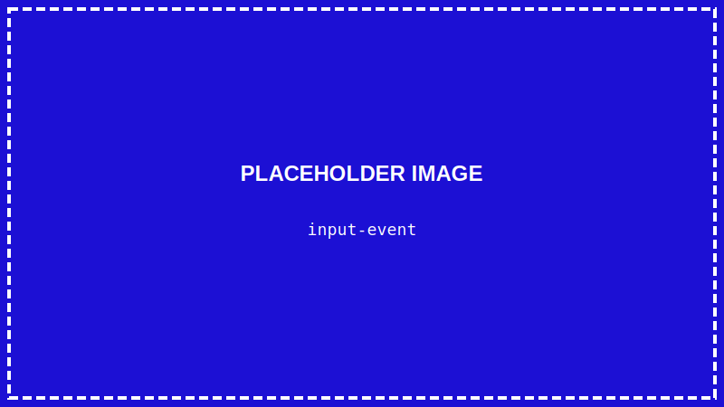
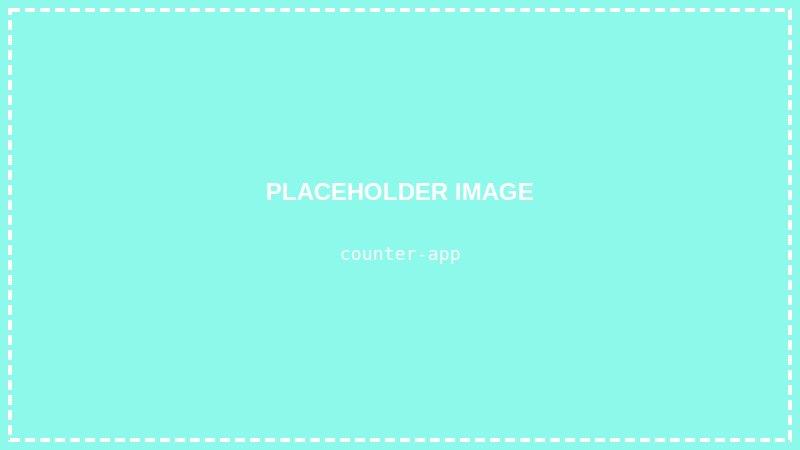

<details>
<summary>💡 AIに質問するときはここをクリック</summary>

ChatGPTやClaudeなどのAIに質問するときは、以下をコピーして最初に貼り付けてね！

```
【TypeScript講座 学習状況】
現在地: 第14回「ユーザーの操作に反応しよう（イベント処理）」

■ 学習済みの内容:
- VSCode、ターミナル、Node.js 24 LTS
- HTML/CSSの基本、Flexbox
- TypeScriptの基礎（変数、型、if文、関数、配列）
- DOM操作:
  - document.querySelector() で要素を取得
  - textContent で文字を変更
  - innerHTML でHTMLを変更
  - style.xxx でスタイルを変更
  - npx tsc でコンパイル
  - as HTMLElement（型アサーション）
- 【作品①】自己紹介ページ
- おみくじプログラム
- 【作品②】じゃんけんゲーム（コンソール版）

■ まだ習っていない内容:
オブジェクト、type定義、React など

上記の学習状況を踏まえて、初心者にも分かるように答えてください。
まだ習っていない概念は使わないでください。

【質問】
ここに質問を書いてね
```

</details>

> **この回で学ぶこと**
> - イベントとは何か
> - addEventListener の使い方
> - クリックイベントの処理
> - 入力イベントの処理
> - 【実践】カウンターアプリを作る

---

## はじめに

前回、TypeScriptからHTMLを操作する方法を学びました。

でも、今のままだとページを開いた時に1回だけ処理が実行されるだけです。

今回は「**イベント**」を使って、ユーザーの操作（クリック、入力など）に反応するプログラムを作ります！

---

## イベントとは？

**イベント**とは、ユーザーやブラウザが起こす「出来事」のことです。

例えば：
- ボタンをクリックした → `click` イベント
- キーボードを押した → `keydown` イベント
- テキストを入力した → `input` イベント
- ページが読み込まれた → `load` イベント

これらのイベントを「**監視**」して、発生したら処理を実行する、というのが基本です。

---

## STEP 1: VSCodeでプロジェクトを開く

### 1-1. VSCodeを起動する

デスクトップのVSCodeアイコンをダブルクリックして、VSCodeを起動します。

### 1-2. プロジェクトフォルダを開く

**「ファイル」→「フォルダーを開く」** から、`typescript-lesson` フォルダを開きます。

### 1-3. ターミナルを開く

**「ターミナル」→「新しいターミナル」** をクリック

---

## STEP 2: ファイルを準備する

### 2-1. HTMLファイルを作成

新しいファイル `event-practice.html` を作成します：

```html
<!DOCTYPE html>
<html lang="ja">
<head>
    <meta charset="UTF-8">
    <title>イベント処理の練習</title>
    <style>
        body {
            font-family: sans-serif;
            padding: 20px;
            max-width: 600px;
            margin: 0 auto;
        }
        .box {
            padding: 20px;
            margin: 20px 0;
            border: 1px solid #ccc;
            border-radius: 8px;
        }
        button {
            padding: 10px 20px;
            font-size: 16px;
            margin: 5px;
            cursor: pointer;
        }
        input {
            padding: 10px;
            font-size: 16px;
            width: 200px;
        }
        #output {
            font-size: 18px;
            color: #333;
            min-height: 30px;
        }
    </style>
</head>
<body>
    <h1>イベント処理の練習</h1>

    <div class="box">
        <h2>クリックイベント</h2>
        <button id="btn-hello">挨拶する</button>
        <button id="btn-random">ランダム数字</button>
        <p id="output">ボタンを押してみてね</p>
    </div>

    <div class="box">
        <h2>入力イベント</h2>
        <input type="text" id="name-input" placeholder="名前を入力">
        <p id="greeting"></p>
    </div>

    <script src="event-practice.js"></script>
</body>
</html>
```

**`Ctrl + S`** で保存します。

### 2-2. TypeScriptファイルを作成

新しいファイル `event-practice.ts` を作成します：

```typescript
console.log("イベント練習スタート！");
```

**`Ctrl + S`** で保存します。

---

## STEP 3: addEventListener を使う

イベントを監視するには `addEventListener` を使います。

### 基本の形

```typescript
要素.addEventListener("イベント名", 処理する関数);
```

### 3-1. クリックイベントを追加

`event-practice.ts` を書き換えます：

```typescript
// 要素を取得
const btnHello = document.querySelector("#btn-hello");
const output = document.querySelector("#output");

// ボタンがクリックされたら実行
btnHello?.addEventListener("click", () => {
    if (output) {
        output.textContent = "こんにちは！";
    }
});
```

**`Ctrl + S`** で保存 → コンパイル：

```
npx tsc event-practice.ts
```

Live Serverでブラウザを開き、「挨拶する」ボタンをクリック！


> **`?.` とは？**
> `btnHello?.addEventListener` の `?.` は「オプショナルチェーン」という書き方です。
>
> `querySelector` でボタンが見つからないと `null`（何もない）が返ってきます。
> `null` に対して `.addEventListener` を呼ぶとエラーになってしまいます。
>
> `?.` を使うと「もし `btnHello` が `null` だったら、何もしない」という意味になり、エラーを防げます。
> 今は「エラーを防ぐおまじない」と覚えておけばOKです。

---

## STEP 4: 複数のボタンにイベントを追加

もう一つのボタンにもイベントを追加しましょう：

```typescript
// 要素を取得
const btnHello = document.querySelector("#btn-hello");
const btnRandom = document.querySelector("#btn-random");
const output = document.querySelector("#output");

// 「挨拶する」ボタン
btnHello?.addEventListener("click", () => {
    if (output) {
        output.textContent = "こんにちは！";
    }
});

// 「ランダム数字」ボタン
btnRandom?.addEventListener("click", () => {
    const randomNumber = Math.floor(Math.random() * 100);
    if (output) {
        output.textContent = `ランダムな数字: ${randomNumber}`;
    }
});
```

**`Ctrl + S`** → コンパイル → ブラウザ更新

「ランダム数字」ボタンを押すたびに、違う数字が表示されます！

---

## STEP 5: 入力イベントを使う

テキスト入力に反応するイベントを追加しましょう。

```typescript
// 入力欄とグリーティング表示欄を取得
const nameInput = document.querySelector("#name-input") as HTMLInputElement;
const greeting = document.querySelector("#greeting");

// 入力されるたびに実行
nameInput?.addEventListener("input", () => {
    const name = nameInput.value;

    if (greeting) {
        if (name) {
            greeting.textContent = `こんにちは、${name}さん！`;
        } else {
            greeting.textContent = "";
        }
    }
});
```

**`Ctrl + S`** → コンパイル → ブラウザ更新

入力欄に名前を入力すると、リアルタイムで挨拶が表示されます！



> **`as HTMLInputElement`**
> input要素には `.value` プロパティがあります。
> TypeScriptに「これはinput要素だよ」と教えるために型アサーションを使います。

---

## STEP 6: 【実践】カウンターアプリを作ろう

学んだことを使って、カウンターアプリを作りましょう！

### 6-1. 新しいHTMLファイル

`counter.html` を作成：

```html
<!DOCTYPE html>
<html lang="ja">
<head>
    <meta charset="UTF-8">
    <title>カウンターアプリ</title>
    <style>
        body {
            font-family: sans-serif;
            display: flex;
            justify-content: center;
            align-items: center;
            min-height: 100vh;
            margin: 0;
            background-color: #f0f0f0;
        }
        .counter-app {
            background-color: white;
            padding: 40px;
            border-radius: 16px;
            box-shadow: 0 4px 6px rgba(0, 0, 0, 0.1);
            text-align: center;
        }
        h1 {
            margin-top: 0;
            color: #333;
        }
        .count {
            font-size: 72px;
            font-weight: bold;
            color: #4a90d9;
            margin: 20px 0;
        }
        .buttons {
            display: flex;
            gap: 10px;
            justify-content: center;
        }
        button {
            padding: 15px 30px;
            font-size: 24px;
            border: none;
            border-radius: 8px;
            cursor: pointer;
            transition: background-color 0.2s;
        }
        .btn-increment {
            background-color: #4CAF50;
            color: white;
        }
        .btn-increment:hover {
            background-color: #45a049;
        }
        .btn-decrement {
            background-color: #f44336;
            color: white;
        }
        .btn-decrement:hover {
            background-color: #da190b;
        }
        .btn-reset {
            background-color: #9e9e9e;
            color: white;
        }
        .btn-reset:hover {
            background-color: #757575;
        }
    </style>
</head>
<body>
    <div class="counter-app">
        <h1>カウンター</h1>
        <div class="count" id="count">0</div>
        <div class="buttons">
            <button class="btn-decrement" id="btn-decrement">−</button>
            <button class="btn-reset" id="btn-reset">リセット</button>
            <button class="btn-increment" id="btn-increment">＋</button>
        </div>
    </div>

    <script src="counter.js"></script>
</body>
</html>
```

**`Ctrl + S`** で保存します。

### 6-2. TypeScriptファイル

`counter.ts` を作成：

```typescript
// ==================
// カウンターアプリ
// ==================

// カウントの値を保持する変数
let count: number = 0;

// 要素を取得
const countDisplay = document.querySelector("#count");
const btnIncrement = document.querySelector("#btn-increment");
const btnDecrement = document.querySelector("#btn-decrement");
const btnReset = document.querySelector("#btn-reset");

// カウントを画面に表示する関数
function updateDisplay(): void {
    if (countDisplay) {
        countDisplay.textContent = count.toString();
    }
}

// 増やすボタン
btnIncrement?.addEventListener("click", () => {
    count++;
    updateDisplay();
});

// 減らすボタン
btnDecrement?.addEventListener("click", () => {
    count--;
    updateDisplay();
});

// リセットボタン
btnReset?.addEventListener("click", () => {
    count = 0;
    updateDisplay();
});

// 初期表示
updateDisplay();
```

**`Ctrl + S`** で保存 → コンパイル：

```
npx tsc counter.ts
```

`counter.html` をLive Serverで開いて試してみましょう！



---

## 【カウンターアプリ完成！】

おめでとうございます！カウンターアプリが完成しました！

使った技術：
- `addEventListener` でクリックイベントを監視
- 変数 `count` で状態を管理
- `textContent` で画面を更新

---

## よく使うイベント

| イベント名 | 発生タイミング |
|-----------|---------------|
| `click` | クリックした時 |
| `input` | 入力内容が変わった時 |
| `change` | 入力が確定した時 |
| `submit` | フォームを送信した時 |
| `keydown` | キーを押した時 |
| `keyup` | キーを離した時 |
| `mouseover` | マウスが乗った時 |
| `mouseout` | マウスが離れた時 |

---

## まとめ

この回でやったこと：

- ✅ イベントとは「ユーザーの操作」
- ✅ `addEventListener` でイベントを監視
- ✅ クリックイベントで処理を実行
- ✅ 入力イベントでリアルタイム反応
- ✅ カウンターアプリを作った

---

## 次回予告

次回は「**データをまとめて管理しよう（オブジェクト）**」です。

複数の関連データを1つにまとめる「オブジェクト」を学びます。クイズゲームへの準備です！

---

## 練習問題（やってみよう）

1. カウンターに「+10」「-10」ボタンを追加してみよう
2. カウントが10以上になったら色を変えてみよう
3. 入力した名前の文字数を表示する機能を作ってみよう

コンパイル（`npx tsc ファイル名`）と保存（`Ctrl + S`）を忘れずに！
