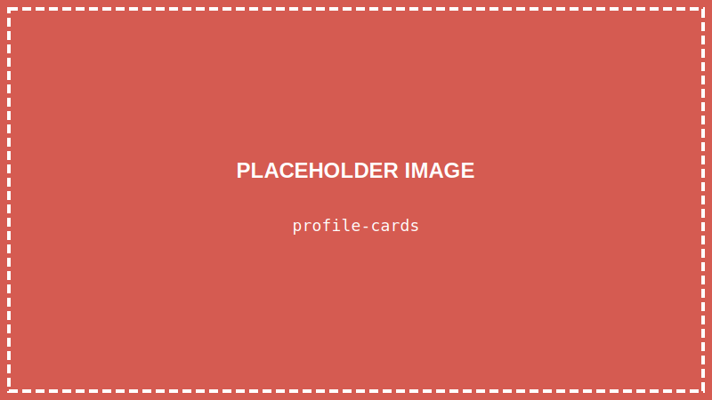

<details>
<summary>💡 AIに質問するときはここをクリック</summary>

ChatGPTやClaudeなどのAIに質問するときは、以下をコピーして最初に貼り付けてね！

```
【TypeScript講座 学習状況】
現在地: 第15回「データをまとめて管理しよう（オブジェクト）」

■ 学習済みの内容:
- VSCode、ターミナル、Node.js/TypeScript環境
- HTML/CSSの基本、Flexbox
- TypeScriptの基礎（変数、型、if文、関数、配列）
- DOM操作（querySelector, textContent, style）
- イベント処理:
  - addEventListener でイベントを監視
  - click イベント（クリック）
  - input イベント（入力）
  - オプショナルチェーン（?.）
  - as HTMLInputElement
- 【作品①】自己紹介ページ
- おみくじプログラム
- 【作品②】じゃんけんゲーム
- カウンターアプリ

■ まだ習っていない内容:
React など

上記の学習状況を踏まえて、初心者にも分かるように答えてください。
まだ習っていない概念は使わないでください。

【質問】
ここに質問を書いてね
```

</details>

> **この回で学ぶこと**
> - オブジェクトとは何か
> - オブジェクトの作り方
> - プロパティへのアクセス方法
> - オブジェクトの型を定義する方法（type）
> - オブジェクトの配列

---

## はじめに

前回、イベント処理を学んでカウンターアプリを作りました。

今回は「**オブジェクト**」を学びます。

オブジェクトを使うと、関連するデータを**ひとまとめ**に管理できます！

---

## オブジェクトとは？

**オブジェクト**とは、「名前付きのデータの集まり」です。

例えば、ユーザー情報を管理したい場合：

```typescript
// 変数を複数使う方法（バラバラ…）
const userName = "山田太郎";
const userAge = 16;
const userIsStudent = true;

// オブジェクトを使う方法（まとまってる！）
const user = {
    name: "山田太郎",
    age: 16,
    isStudent: true
};
```

オブジェクトの各データを「**プロパティ**」と呼びます。

---

## STEP 1: VSCodeでプロジェクトを開く

### 1-1. VSCodeを起動する

デスクトップのVSCodeアイコンをダブルクリックして、VSCodeを起動します。

### 1-2. プロジェクトフォルダを開く

**「ファイル」→「フォルダーを開く」** から、`typescript-lesson` フォルダを開きます。

### 1-3. ターミナルを開く

**「ターミナル」→「新しいターミナル」** をクリック

---

## STEP 2: 新しいファイルを作る

新しいファイル `objects.ts` を作成します。

---

## STEP 3: オブジェクトを作ってみよう

### 3-1. 基本のオブジェクト

```typescript
const user = {
    name: "山田太郎",
    age: 16,
    isStudent: true
};

console.log(user);
```

**`Ctrl + S`** で保存して実行：

```
npx ts-node objects.ts
```

結果：
```
{ name: '山田太郎', age: 16, isStudent: true }
```

### 3-2. プロパティにアクセスする

プロパティには **ドット（.）** でアクセスします：

```typescript
const user = {
    name: "山田太郎",
    age: 16,
    isStudent: true
};

console.log(user.name);      // 山田太郎
console.log(user.age);       // 16
console.log(user.isStudent); // true
```

### ブラケット記法

ブラケット（`[]`）でもアクセスできます：

```typescript
console.log(user["name"]);  // 山田太郎
```

変数でプロパティ名を指定したい時に便利です。

---

## STEP 4: オブジェクトに型をつける

TypeScriptでは、オブジェクトにも**型**をつけられます。

### type で型を定義する

```typescript
// User型を定義
type User = {
    name: string;
    age: number;
    isStudent: boolean;
};

// User型のオブジェクトを作成
const user: User = {
    name: "山田太郎",
    age: 16,
    isStudent: true
};
```

型を定義すると、間違ったデータを入れようとした時にエラーになります：

```typescript
const user: User = {
    name: "山田太郎",
    age: "16歳",     // エラー！ number に string は入れられない
    isStudent: true
};
```

### 型定義のメリット

1. **間違いを防げる** - 違う型のデータを入れるとエラー
2. **補完が効く** - `user.` と打つとプロパティ候補が出る
3. **ドキュメント代わり** - どんなデータがあるか一目でわかる

---

## STEP 5: オブジェクトの配列

オブジェクトを配列に入れることで、複数のデータを管理できます。

```typescript
type User = {
    name: string;
    age: number;
    isStudent: boolean;
};

// User型の配列
const users: User[] = [
    { name: "山田太郎", age: 16, isStudent: true },
    { name: "佐藤花子", age: 17, isStudent: true },
    { name: "田中一郎", age: 25, isStudent: false }
];

// 全員の名前を表示
for (const user of users) {
    console.log(user.name);
}
```

結果：
```
山田太郎
佐藤花子
田中一郎
```

---

## STEP 6: 実践してみよう

学んだことを使って、プロフィールカードを表示するプログラムを作りましょう。

### 6-1. HTMLファイル

`profile-card.html` を作成：

```html
<!DOCTYPE html>
<html lang="ja">
<head>
    <meta charset="UTF-8">
    <title>プロフィールカード</title>
    <style>
        body {
            font-family: sans-serif;
            background-color: #f0f0f0;
            padding: 20px;
        }
        .card-container {
            display: flex;
            flex-wrap: wrap;
            gap: 20px;
            justify-content: center;
        }
        .card {
            background-color: white;
            border-radius: 12px;
            padding: 20px;
            width: 250px;
            box-shadow: 0 2px 8px rgba(0,0,0,0.1);
            text-align: center;
        }
        .card img {
            width: 100px;
            height: 100px;
            border-radius: 50%;
            object-fit: cover;
        }
        .card h2 {
            margin: 10px 0 5px 0;
            color: #333;
        }
        .card .age {
            color: #666;
            font-size: 14px;
        }
        .card .hobby {
            background-color: #e3f2fd;
            color: #1976d2;
            padding: 5px 10px;
            border-radius: 20px;
            display: inline-block;
            margin-top: 10px;
            font-size: 14px;
        }
    </style>
</head>
<body>
    <h1 style="text-align: center;">メンバー紹介</h1>
    <div class="card-container" id="card-container">
        <!-- ここにカードが表示される -->
    </div>

    <script src="profile-card.js"></script>
</body>
</html>
```

**`Ctrl + S`** で保存します。

### 6-2. TypeScriptファイル

`profile-card.ts` を作成：

```typescript
// メンバーの型を定義
type Member = {
    name: string;
    age: number;
    hobby: string;
    image: string;
};

// メンバーデータ
const members: Member[] = [
    {
        name: "山田太郎",
        age: 16,
        hobby: "ゲーム",
        image: "https://via.placeholder.com/100"
    },
    {
        name: "佐藤花子",
        age: 17,
        hobby: "読書",
        image: "https://via.placeholder.com/100"
    },
    {
        name: "田中一郎",
        age: 15,
        hobby: "サッカー",
        image: "https://via.placeholder.com/100"
    },
    {
        name: "鈴木美咲",
        age: 16,
        hobby: "プログラミング",
        image: "https://via.placeholder.com/100"
    }
];

// カードを作成する関数
function createCard(member: Member): string {
    return `
        <div class="card">
            
            <h2>${member.name}</h2>
            <p class="age">${member.age}歳</p>
            <span class="hobby">${member.hobby}</span>
        </div>
    `;
}

// カードを表示する
function displayCards(): void {
    const container = document.querySelector("#card-container");

    if (container) {
        let html = "";

        for (const member of members) {
            html += createCard(member);
        }

        container.innerHTML = html;
    }
}

// 実行
displayCards();
```

**`Ctrl + S`** で保存 → コンパイル：

```
npx tsc profile-card.ts
```

Live Serverで `profile-card.html` を開きます。



---

## オブジェクトのプロパティを変更する

```typescript
const user: User = {
    name: "山田太郎",
    age: 16,
    isStudent: true
};

// プロパティを変更
user.age = 17;
console.log(user.age);  // 17
```

> **`const` でも変更できる？**
> `const` は「変数の再代入」を禁止しますが、オブジェクトの中身の変更は許可されます。

---

## オプショナルプロパティ

「あってもなくてもいい」プロパティには `?` をつけます：

```typescript
type User = {
    name: string;
    age: number;
    nickname?: string;  // あってもなくてもOK
};

const user1: User = { name: "山田", age: 16 };  // OK
const user2: User = { name: "佐藤", age: 17, nickname: "さとちゃん" };  // OK
```

> **💡 `?` と `?.` の違い**
> 似ている記号ですが、使う場面が違います：
>
> | 記号 | 名前 | 使う場所 | 意味 |
> |-----|------|----------|------|
> | `nickname?:` | オプショナルプロパティ | **型定義**の中 | 「このプロパティはなくてもOK」 |
> | `user?.name` | オプショナルチェーン | **値にアクセス**するとき | 「nullじゃなければアクセス」 |
>
> ```typescript
> // 型定義で使う ? → オプショナルプロパティ
> type User = {
>     name: string;
>     nickname?: string;  // あってもなくてもいい
> };
>
> // 値にアクセスするときの ?. → オプショナルチェーン（第13回で学習）
> const el = document.querySelector("#title");
> el?.textContent;  // elがnullでなければtextContentにアクセス
> ```

---

## まとめ

この回でやったこと：

- ✅ オブジェクトとは「名前付きデータの集まり」
- ✅ ドット記法でプロパティにアクセス
- ✅ `type` で型を定義できる
- ✅ オブジェクトの配列で複数データを管理
- ✅ プロフィールカードを作った

---

## 次回予告

次回は「**【作品③】クイズゲームを作ろう**」です！

今回学んだオブジェクトの配列を使って、クイズデータを管理し、本格的なクイズゲームを完成させます！

---

## 練習問題（やってみよう）

1. 自分のプロフィールをオブジェクトで作ってみよう
2. メンバーを追加して、カードを増やしてみよう
3. `Member` 型に新しいプロパティ（例: `school`）を追加してみよう

コンパイル（`npx tsc ファイル名`）と保存（`Ctrl + S`）を忘れずに！
