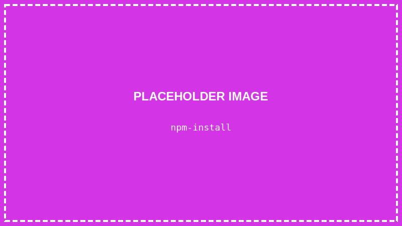
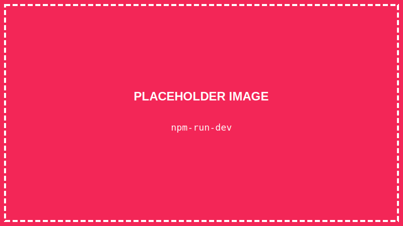
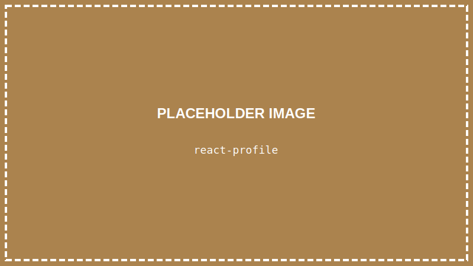

<details>
<summary>💡 AIに質問するときはここをクリック</summary>

ChatGPTやClaudeなどのAIに質問するときは、以下をコピーして最初に貼り付けてね！

```
【TypeScript講座 学習状況】
現在地: 第16回「Reactを始めよう」

■ 学習済みの内容:
- VSCode、ターミナル、Node.js/TypeScript環境
- HTML/CSSの基本、Flexbox
- TypeScriptの基礎:
  - 変数と型（let, const, string, number, boolean）
  - if文、比較演算子、論理演算子
  - 関数（引数、戻り値、アロー関数）
  - 配列（作成、メソッド、forループ）
  - オブジェクト（type定義、オブジェクトの配列）
- DOM操作（querySelector, textContent, innerHTML, style）
- イベント処理（addEventListener, click, input）
- 【作品①】自己紹介ページ
- おみくじプログラム
- 【作品②】じゃんけんゲーム
- カウンターアプリ
- プロフィールカード
- 【作品③】クイズゲーム

■ まだ習っていない内容:
useState、props など（これから学びます）
※ 今回からReactを使い始めます

上記の学習状況を踏まえて、初心者にも分かるように答えてください。
まだ習っていない概念は使わないでください。

【質問】
ここに質問を書いてね
```

</details>

> **この回で学ぶこと**
> - Reactとは何か、なぜ使うのか
> - Viteでプロジェクトを作成する方法
> - コンポーネントとは何か
> - JSXの書き方

---

## はじめに

前回までで、TypeScriptとDOM操作を使ってクイズゲームを作りました。

でも、コードが長くなってきませんでしたか？

今回からは「**React**」というライブラリを使って、もっと**効率よく**Webアプリを作る方法を学びます！

> **🎯 Reactに入る前に（心構え）**
>
> ここから先は、今までとは少し雰囲気が変わります。
>
> **今まで**：`document.querySelector` で要素を取得して、`textContent` で変更…
> **これから**：「こういう画面を表示したい」と書くだけで、Reactが自動でやってくれる
>
> 最初は「なんで動くの？」と不思議に感じるかもしれませんが、大丈夫。
> **「こう書くとこう動く」というパターンを覚えるだけ**でOKです。
>
> また、プロジェクトの作り方も変わります：
> - 今まで：`typescript-lesson` フォルダで作業
> - これから：Viteで新しいフォルダ（`react-shindan`）を作成
>
> 新しいフォルダで、新しいスタートです！

> **ライブラリとは？**
> 誰かが作った「便利な道具箱」のようなものです。
> 自分でゼロから全部作らなくても、ライブラリを使えば便利な機能をすぐに使えます。

---

## Reactとは？

**React**は、Facebookが開発した**UIを作るためのライブラリ**です。

> **UIとは？**
> User Interface（ユーザーインターフェース）の略で、画面に表示されるボタンや文字など、ユーザーが見たり操作したりする部分のことです。

### なぜReactを使うの？

今まで書いてきたコード（DOM操作）には問題がありました：

```typescript
// DOM操作だと、こんなコードが増えていく…
const element = document.querySelector("#title");
if (element) {
    element.textContent = "新しいタイトル";
}

const button = document.querySelector("#btn");
button?.addEventListener("click", () => {
    // 処理...
});
```

Reactを使うと：

```tsx
// Reactだと、シンプルに書ける
function App() {
    return (
        <div>
            <h1>新しいタイトル</h1>
            <button onClick={() => console.log("クリック！")}>
                ボタン
            </button>
        </div>
    );
}
```

HTMLのような見た目で、直感的に書けます！

---

## STEP 1: VSCodeを起動する

デスクトップのVSCodeアイコンをダブルクリックして、VSCodeを起動します。

---

## STEP 2: 新しいターミナルを開く

**「ターミナル」→「新しいターミナル」** をクリック

---

## STEP 3: Reactプロジェクトを作成する

### 3-1. デスクトップに移動

```
cd Desktop
```

### 3-2. Viteでプロジェクトを作成

**Vite（ヴィート）** は、Reactプロジェクトを簡単に作れるツールです。

```
npm create vite@latest react-shindan -- --template react-ts
```


> **コマンドの意味**
> - `npm create vite@latest` → Viteを使ってプロジェクト作成
> - `react-shindan` → プロジェクト名（新しいフォルダ名）
> - `--template react-ts` → React + TypeScriptのテンプレート（ひな形）を使う
>
> **テンプレートとは？** あらかじめ用意された「ひな形」のことです。ゼロから設定しなくても、すぐに開発を始められます。

> **なぜ新しいフォルダ？**
> Reactは専用のプロジェクト構成が必要なので、今までの `typescript-lesson` フォルダとは別に新しいフォルダを作ります。
> これ以降は、この `react-shindan` フォルダで作業します。

### 3-3. プロジェクトフォルダに移動

```
cd react-shindan
```

### 3-4. 必要なパッケージをインストール

```
npm install
```



少し時間がかかります。終わるまで待ちましょう。

### 3-5. 開発サーバーを起動

```
npm run dev
```



```
  VITE v5.x.x  ready in xxx ms

  ➜  Local:   http://localhost:5173/
```

> **開発サーバーとは？**
> `npm run dev` を実行すると、「開発サーバー」というものが起動します。
> これが動いている間、ブラウザでページを表示できます。
>
> **重要：** このターミナルは開発サーバーが使用中なので、**新しいコマンドを打つことはできません**。
> 開発サーバーを止めるには `Ctrl + C` を押します。
> 開発中は、このターミナルは触らずにそのままにしておいてください。

### 3-6. ブラウザで確認

表示されたURL（`http://localhost:5173/`）を **Ctrl + クリック** で開きます。


Reactのデモ画面が表示されれば成功です！

---

## STEP 4: VSCodeでプロジェクトを開く

### 4-1. 新しいウィンドウでフォルダを開く

**「ファイル」→「フォルダーを開く」** から、デスクトップの `react-shindan` フォルダを開きます。

### 4-2. プロジェクトの構造を確認

```
react-shindan/
├── node_modules/    # インストールしたパッケージ
├── public/          # 静的ファイル
├── src/             # ソースコード（ここを編集する）
│   ├── App.tsx      # メインのコンポーネント
│   ├── main.tsx     # エントリーポイント
│   └── ...
├── index.html       # HTMLファイル
├── package.json     # プロジェクト設定
└── ...
```


**重要なファイル**：
- `src/App.tsx` → メインのコンポーネント（ここを編集します）
- `src/main.tsx` → アプリの起動ポイント（プログラムが最初に実行される場所）

---

## STEP 5: コンポーネントを理解する

Reactでは、画面の部品を「**コンポーネント**」と呼びます。

`src/App.tsx` を開いてみましょう：

```tsx
function App() {
    return (
        <div>
            <h1>Vite + React</h1>
            {/* 他の内容... */}
        </div>
    );
}

export default App;
```

これが「**コンポーネント**」です！

### コンポーネントのルール

1. **関数**で定義する（大文字で始める）
2. **return** でJSXを返す
3. **export** で他のファイルから使えるようにする

---

## STEP 6: App.tsxを書き換えてみよう

### 6-1. シンプルな内容に書き換える

`src/App.tsx` を以下のように書き換えます：

```tsx
function App() {
    return (
        <div>
            <h1>はじめてのReact</h1>
            <p>Reactを学んでいます！</p>
        </div>
    );
}

export default App;
```

**`Ctrl + S`** で保存します。

### 6-2. ブラウザを確認

ブラウザが**自動で更新**され、変更が反映されます！


> **ホットリロード**
> Reactでは、ファイルを保存すると自動でブラウザが更新されます。
> `npx tsc` のようなコンパイルは不要です！

> **なぜ `tsc` も `ts-node` も使わないの？**
> Viteが裏で自動的にTypeScriptをJavaScriptに変換してくれているからです。
> だから、私たちは「保存するだけ」でOK。とても便利ですね！
> 詳しくは第3回の「TypeScriptの実行方法は3種類ある」を見てください。

---

## STEP 7: JSXを学ぼう

Reactでは、HTMLのような構文「**JSX**」を使います。

### JSXの基本

```tsx
function App() {
    return (
        <div>
            <h1>見出し</h1>
            <p>段落</p>
        </div>
    );
}
```

HTMLとほぼ同じですが、いくつか違いがあります：

### 違い①: classではなくclassName

```tsx
// ❌ HTMLの書き方
<div class="container">

// ✅ JSXの書き方
<div className="container">
```

### 違い②: 閉じタグが必要

```tsx
// ❌ HTMLでは省略できる

<br>

// ✅ JSXでは閉じる必要あり

<br />
```

### 違い③: JavaScriptを埋め込める

`{}` の中にJavaScript（TypeScript）を書けます：

```tsx
function App() {
    const name = "山田太郎";
    const age = 16;

    return (
        <div>
            <h1>こんにちは、{name}さん！</h1>
            <p>年齢: {age}歳</p>
            <p>来年は{age + 1}歳ですね</p>
        </div>
    );
}
```

---

## STEP 8: 実践してみよう

自分のプロフィールを表示するコンポーネントを作りましょう。

`src/App.tsx` を書き換えます：

```tsx
function App() {
    // 自分の情報
    const profile = {
        name: "山田太郎",
        age: 16,
        hobby: "プログラミング",
        message: "Reactを勉強中！"
    };

    return (
        <div style={{ padding: "20px", fontFamily: "sans-serif" }}>
            <h1>自己紹介</h1>

            <div style={{
                backgroundColor: "#f5f5f5",
                padding: "20px",
                borderRadius: "8px",
                maxWidth: "400px"
            }}>
                <h2>{profile.name}</h2>
                <p>年齢: {profile.age}歳</p>
                <p>趣味: {profile.hobby}</p>
                <p>"{profile.message}"</p>
            </div>
        </div>
    );
}

export default App;
```

**`Ctrl + S`** で保存して、ブラウザを確認！



---

## スタイルの書き方

JSXでは、`style` 属性にオブジェクトを渡します：

```tsx
// CSSの書き方
<div style="background-color: blue; font-size: 20px;">

// JSXの書き方（オブジェクト形式）
<div style={{ backgroundColor: "blue", fontSize: "20px" }}>
```

- ケバブケース（`background-color`）→ キャメルケース（`backgroundColor`）
- 値は文字列で指定

---

## 開発サーバーを止める

ターミナルで **Ctrl + C** を押すと、開発サーバーが停止します。

次回以降、開発を再開するときは：

```
npm run dev
```

を実行してください。

---

## まとめ

この回でやったこと：

- ✅ Reactとは「UIを作るためのライブラリ」
- ✅ Viteでプロジェクトを作成した
- ✅ コンポーネントとは「画面の部品」
- ✅ JSXの基本的な書き方を学んだ
- ✅ 自己紹介コンポーネントを作った

---

## 次回予告

次回は「**画面を変化させよう（state）**」です。

ボタンを押すと数字が増える、といった**動的な画面**を作る方法を学びます。Reactの真価が発揮されます！

---

## 練習問題（やってみよう）

1. 自分の名前と趣味に書き換えてみよう
2. 好きな食べ物を3つ表示してみよう
3. スタイルの色を変えてみよう

保存（`Ctrl + S`）すると自動で更新されます！

<details>
<summary>💡 解答例を見る</summary>

```tsx
function App() {
    const profile = {
        name: "田中花子",
        age: 17,
        hobby: "読書",
        foods: ["カレー", "ラーメン", "寿司"]
    };

    return (
        <div style={{ padding: "20px", fontFamily: "sans-serif" }}>
            <h1>自己紹介</h1>

            <div style={{
                backgroundColor: "#e8f5e9",  // 緑系に変更
                padding: "20px",
                borderRadius: "8px",
                maxWidth: "400px"
            }}>
                <h2>{profile.name}</h2>
                <p>年齢: {profile.age}歳</p>
                <p>趣味: {profile.hobby}</p>

                {/* 好きな食べ物を3つ表示 */}
                <h3>好きな食べ物</h3>
                <ul>
                    <li>{profile.foods[0]}</li>
                    <li>{profile.foods[1]}</li>
                    <li>{profile.foods[2]}</li>
                </ul>
            </div>
        </div>
    );
}

export default App;
```

</details>

---

## 困ったときは（よくあるエラーと対処法）

### 「npm create vite」でエラーが出る

**エラー例：**
```
npm ERR! code ENOENT
```
→ 正しいフォルダにいるか確認（`cd Desktop` してから実行）

---

### 「npm run dev」でエラーが出る

**エラー例①：依存関係がない**
```
Cannot find module 'react'
```
→ `npm install` を実行してから、もう一度 `npm run dev`

**エラー例②：ポートが使用中**
```
Port 5173 is already in use
```
→ 別のターミナルで開発サーバーが動いている可能性があります
→ そのターミナルを探して `Ctrl + C` で止めるか、パソコンを再起動

---

### 画面が真っ白 / エラーが表示される

1. **ブラウザのコンソール**（F12 → Console）を確認
2. よくある原因：
   - JSXの閉じタグ忘れ（`<div>` に対する `</div>`）
   - `className` を `class` と書いている
   - `{}` の中の構文エラー

**エラー例：**
```
Unexpected token '<'
```
→ JSXの構文に問題があります。閉じタグや括弧を確認

---

### 保存しても画面が更新されない

1. ターミナルで開発サーバー（`npm run dev`）が動いているか確認
2. 動いていなければ、もう一度 `npm run dev`
3. ブラウザで正しいURL（`http://localhost:5173/`）を開いているか確認

---

### ターミナルでコマンドが打てない

開発サーバー（`npm run dev`）が動いているターミナルでは、新しいコマンドは打てません。

**対処法：**
- 新しいターミナルを開く（**「ターミナル」→「新しいターミナル」**）
- または、`Ctrl + C` で開発サーバーを一旦止める（作業後に `npm run dev` で再開）
