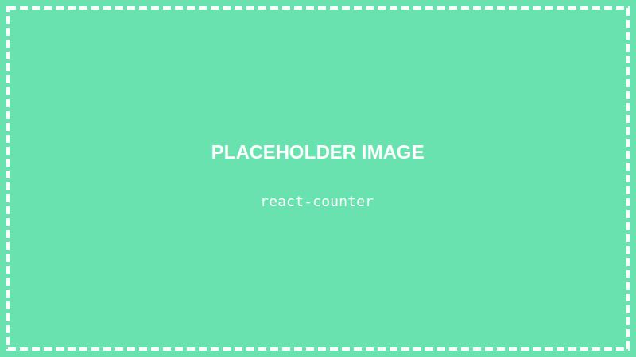
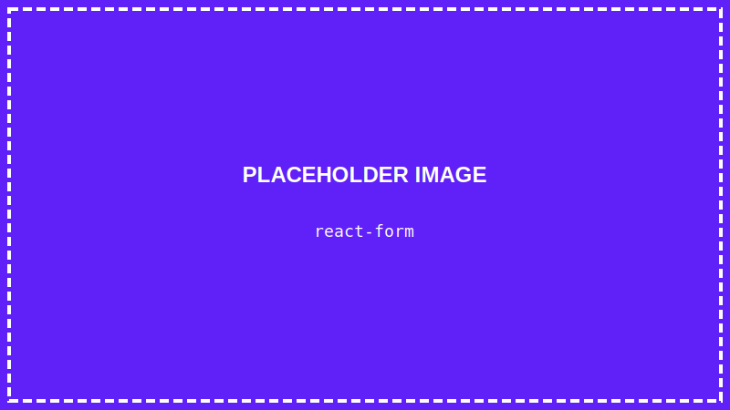

<details>
<summary>💡 AIに質問するときはここをクリック</summary>

ChatGPTやClaudeなどのAIに質問するときは、以下をコピーして最初に貼り付けてね！

```
【TypeScript講座 学習状況】
現在地: 第17回「画面を変化させよう（state）」

■ 学習済みの内容:
- VSCode、ターミナル、Node.js/TypeScript環境
- HTML/CSSの基本、Flexbox
- TypeScriptの基礎（変数、型、if文、関数、配列、オブジェクト）
- DOM操作、イベント処理
- React基礎:
  - Viteでプロジェクト作成（npm create vite）
  - コンポーネント（関数コンポーネント）
  - JSX（HTMLに似た書き方）
  - className（classの代わり）
  - {} で変数を埋め込む
  - style={{ }} でスタイルを書く
  - npm run dev で開発サーバー起動
- 【作品①】自己紹介ページ
- 【作品②】じゃんけんゲーム
- 【作品③】クイズゲーム

■ まだ習っていない内容:
props など

上記の学習状況を踏まえて、初心者にも分かるように答えてください。
まだ習っていない概念は使わないでください。

【質問】
ここに質問を書いてね
```

</details>

> **この回で学ぶこと**
> - なぜstateが必要なのか
> - useStateの使い方
> - stateが変わると画面が自動更新される仕組み
> - stateの注意点
> - 【実践】カウンターをReactで作る

---

## はじめに

前回、Reactの基本とJSXを学びました。

今回は「**state（ステート）**」を学びます。

stateを使うと、**画面を動的に変化**させることができます！

---

## なぜstateが必要？

普通の変数だと、値を変えても画面は更新されません：

```tsx
function App() {
    let count = 0;  // 普通の変数

    const handleClick = () => {
        count = count + 1;  // 値は変わるけど…
        console.log(count);  // ログには出るけど…
    };

    return (
        <div>
            <p>カウント: {count}</p>  {/* 画面は0のまま！ */}
            <button onClick={handleClick}>増やす</button>
        </div>
    );
}
```

**state** を使うと、値が変わった時に自動で画面が更新されます！

---

## STEP 1: プロジェクトを開く

### 1-1. VSCodeを起動する

デスクトップのVSCodeアイコンをダブルクリックして、VSCodeを起動します。

### 1-2. プロジェクトフォルダを開く

**「ファイル」→「フォルダーを開く」** から、デスクトップの `react-shindan` フォルダを開きます。

### 1-3. ターミナルを開く

**「ターミナル」→「新しいターミナル」** をクリック

### 1-4. 開発サーバーを起動

```
npm run dev
```

ブラウザで `http://localhost:5173/` を開きます。

---

## STEP 2: useStateを使ってみよう

### 2-1. 基本の形

```tsx
import { useState } from "react";

function App() {
    const [count, setCount] = useState(0);
    //    ↑値    ↑更新関数         ↑初期値

    return (
        <div>
            <p>カウント: {count}</p>
        </div>
    );
}
```

### 2-2. 分解して理解する

```tsx
const [count, setCount] = useState(0);
```

- `useState(0)` → 初期値0でstateを作成
- `count` → 現在の値を読み取る変数
- `setCount` → 値を更新する関数

---

## STEP 3: カウンターを作ってみよう

`src/App.tsx` を書き換えます：

```tsx
import { useState } from "react";

function App() {
    const [count, setCount] = useState(0);

    const increment = () => {
        setCount(count + 1);
    };

    const decrement = () => {
        setCount(count - 1);
    };

    const reset = () => {
        setCount(0);
    };

    return (
        <div style={{ padding: "20px", textAlign: "center" }}>
            <h1>カウンター</h1>
            <p style={{ fontSize: "48px", fontWeight: "bold" }}>{count}</p>
            <div>
                <button onClick={decrement} style={buttonStyle}>−</button>
                <button onClick={reset} style={buttonStyle}>リセット</button>
                <button onClick={increment} style={buttonStyle}>＋</button>
            </div>
        </div>
    );
}

const buttonStyle = {
    padding: "10px 20px",
    fontSize: "20px",
    margin: "5px",
    cursor: "pointer"
};

export default App;
```

**`Ctrl + S`** で保存して、ブラウザで試してみましょう！



ボタンを押すと、カウントが増減します！

---

## STEP 4: stateの仕組みを理解する

### なぜ画面が更新される？

1. ボタンをクリック
2. `setCount(count + 1)` が実行される
3. Reactが「stateが変わった！」と検知
4. コンポーネントが**再レンダリング**（再描画）される
5. 新しい値で画面が表示される

> **レンダリングとは？**
> 「画面を描画する」という意味です。「再レンダリング」は、画面を描き直すことです。

### 重要: setCountを使わないと更新されない

```tsx
// ❌ これでは画面が更新されない
count = count + 1;

// ✅ setCountを使う
setCount(count + 1);
```

---

## STEP 5: 複数のstateを使う

stateは何個でも使えます：

```tsx
import { useState } from "react";

function App() {
    const [name, setName] = useState("");
    const [age, setAge] = useState(0);
    const [isStudent, setIsStudent] = useState(false);

    return (
        <div style={{ padding: "20px" }}>
            <h1>プロフィール入力</h1>

            <div style={{ marginBottom: "10px" }}>
                <label>名前: </label>
                <input
                    type="text"
                    value={name}
                    onChange={(e) => setName(e.target.value)}
                />
            </div>

            <div style={{ marginBottom: "10px" }}>
                <label>年齢: </label>
                <input
                    type="number"
                    value={age}
                    onChange={(e) => setAge(Number(e.target.value))}
                />
            </div>

            <div style={{ marginBottom: "10px" }}>
                <label>
                    <input
                        type="checkbox"
                        checked={isStudent}
                        onChange={(e) => setIsStudent(e.target.checked)}
                    />
                    学生です
                </label>
            </div>

            <hr />

            <h2>入力内容</h2>
            <p>名前: {name || "未入力"}</p>
            <p>年齢: {age}歳</p>
            <p>学生: {isStudent ? "はい" : "いいえ"}</p>
        </div>
    );
}

export default App;
```

**`Ctrl + S`** で保存して試してみましょう。

入力すると、リアルタイムで下の表示が変わります！



---

## STEP 6: stateの注意点

### 注意①: stateを直接変更しない

```tsx
// ❌ ダメな例
count = 10;

// ✅ 正しい例
setCount(10);
```

### 注意②: 配列やオブジェクトは新しく作る

```tsx
const [items, setItems] = useState(["A", "B", "C"]);

// ❌ ダメな例（元の配列を変更）
items.push("D");
setItems(items);

// ✅ 正しい例（新しい配列を作る）
setItems([...items, "D"]);
```

### 注意③: 前の値を使う時は関数形式

```tsx
// ⚠️ 連続して呼ぶと問題が起きることがある
setCount(count + 1);
setCount(count + 1);

// ✅ 関数形式なら安全
setCount((prev) => prev + 1);
setCount((prev) => prev + 1);
```

---

## STEP 7: 実践 - もう少し凝ったカウンター

```tsx
import { useState } from "react";

function App() {
    const [count, setCount] = useState(0);

    // カウントに応じた色
    const getColor = () => {
        if (count > 0) return "#4CAF50";
        if (count < 0) return "#f44336";
        return "#333";
    };

    return (
        <div style={{
            minHeight: "100vh",
            display: "flex",
            flexDirection: "column",
            justifyContent: "center",
            alignItems: "center",
            backgroundColor: "#f0f0f0"
        }}>
            <div style={{
                backgroundColor: "white",
                padding: "40px",
                borderRadius: "16px",
                boxShadow: "0 4px 6px rgba(0,0,0,0.1)",
                textAlign: "center"
            }}>
                <h1>カウンター</h1>

                <p style={{
                    fontSize: "72px",
                    fontWeight: "bold",
                    color: getColor(),
                    margin: "20px 0"
                }}>
                    {count}
                </p>

                <div>
                    <button
                        onClick={() => setCount((c) => c - 1)}
                        style={{
                            ...buttonStyle,
                            backgroundColor: "#f44336",
                            color: "white"
                        }}
                    >
                        −1
                    </button>

                    <button
                        onClick={() => setCount(0)}
                        style={{
                            ...buttonStyle,
                            backgroundColor: "#9e9e9e",
                            color: "white"
                        }}
                    >
                        リセット
                    </button>

                    <button
                        onClick={() => setCount((c) => c + 1)}
                        style={{
                            ...buttonStyle,
                            backgroundColor: "#4CAF50",
                            color: "white"
                        }}
                    >
                        +1
                    </button>
                </div>

                <p style={{ marginTop: "20px", color: "#666" }}>
                    {count > 0 && "プラスです！ 🎉"}
                    {count < 0 && "マイナスです... 😢"}
                    {count === 0 && "ゼロです"}
                </p>
            </div>
        </div>
    );
}

const buttonStyle = {
    padding: "15px 25px",
    fontSize: "20px",
    margin: "5px",
    border: "none",
    borderRadius: "8px",
    cursor: "pointer"
};

export default App;
```

**`Ctrl + S`** で保存して確認！


---

## まとめ

この回でやったこと：

- ✅ stateとは「画面を更新できる特別な変数」
- ✅ `useState` でstateを作成
- ✅ `setXxx` で値を更新すると画面が再レンダリング
- ✅ 複数のstateを組み合わせられる
- ✅ stateは直接変更せず、set関数を使う

---

## 次回予告

次回は最終回「**【最終作品】診断ゲームを完成させよう**」です！

今回学んだstateと、コンポーネントの分割（props）を使って、診断ゲームを完成させます。この講座の集大成です！

---

## 練習問題（やってみよう）

1. カウンターに「+10」「-10」ボタンを追加してみよう
2. カウントが10以上で「すごい！」、-10以下で「やばい！」と表示してみよう
3. 入力フォームに「クリア」ボタンを追加してみよう

保存（`Ctrl + S`）すると自動で更新されます！
