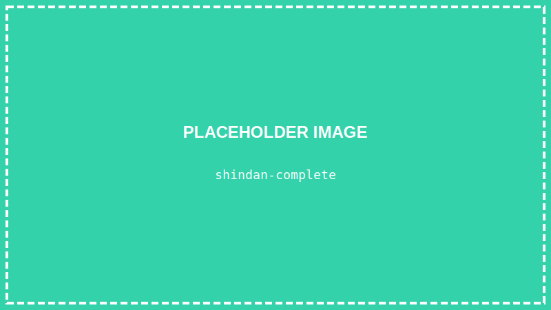

<details>
<summary>💡 AIに質問するときはここをクリック</summary>

ChatGPTやClaudeなどのAIに質問するときは、以下をコピーして最初に貼り付けてね！

```
【TypeScript講座 学習状況】
現在地: 第19回「診断ゲームを完成させよう」（最終回）

■ 学習済みの内容:
- VSCode、ターミナル、Node.js/TypeScript環境
- HTML/CSSの基本、Flexbox
- TypeScriptの基礎:
  - 変数と型（let, const, string, number, boolean）
  - if文、比較演算子、論理演算子
  - 関数（引数、戻り値、アロー関数）
  - 配列（作成、メソッド、forループ）
  - オブジェクト（type定義、オブジェクトの配列）
- DOM操作（querySelector, textContent, innerHTML, style）
- イベント処理（addEventListener, click, input）
- React:
  - Viteでプロジェクト作成
  - コンポーネント、JSX
  - useState（状態管理）
  - setXxx で状態を更新 → 画面が再レンダリング
  - 配列やオブジェクトのstate
- 【作品①】自己紹介ページ
- 【作品②】じゃんけんゲーム
- 【作品③】クイズゲーム
- Reactカウンター

■ 今回学ぶ内容:
props（親から子へのデータ受け渡し）

上記の学習状況を踏まえて、初心者にも分かるように答えてください。

【質問】
ここに質問を書いてね
```

</details>

> **この回で学ぶこと**
> - 診断ゲームの設計
> - コンポーネントを分ける方法（props）
> - 質問データの管理
> - スコア計算と結果表示
> - 【最終作品完成】診断ゲーム

---

## はじめに

いよいよ最終回です！

これまで学んだすべてを組み合わせて、**診断ゲーム**を完成させましょう！

「あなたは○○タイプ！」と診断してくれる、あのゲームです。

---

## 完成イメージ



1. スタート画面 → 「診断を始める」ボタン
2. 質問画面 → 選択肢をクリック
3. 結果画面 → あなたのタイプを表示

---

## STEP 1: プロジェクトを開く

### 1-1. VSCodeを起動する

デスクトップのVSCodeアイコンをダブルクリックして、VSCodeを起動します。

### 1-2. プロジェクトフォルダを開く

**「ファイル」→「フォルダーを開く」** から、デスクトップの `react-shindan` フォルダを開きます。

### 1-3. 開発サーバーを起動

ターミナルを開いて：

```
npm run dev
```

---

## STEP 2: 診断ゲームの設計を考える

### 画面の構成

1. **スタート画面** - ゲーム開始ボタン
2. **質問画面** - 質問と選択肢を表示
3. **結果画面** - 診断結果を表示

### データの構造

```typescript
// 質問データ
type Question = {
    question: string;       // 質問文
    choices: {
        text: string;       // 選択肢のテキスト
        type: string;       // どのタイプに加点するか
    }[];
};

// 結果データ
type Result = {
    type: string;           // タイプ名
    title: string;          // タイトル
    description: string;    // 説明
};
```

---

## STEP 3: 診断データを作成する

> **💡 ファイルを分ける理由**
> 今回は `data.ts` と `App.tsx` の2つのファイルに分けます。
> - `data.ts` → データ（質問や結果）を管理
> - `App.tsx` → 画面の表示とロジック
>
> ファイルを分けると、コードが整理されて見やすくなります。
> 実際の開発では、役割ごとにファイルを分けるのが一般的です。

`src/data.ts` を新規作成します：

```typescript
// 質問の型
export type Question = {
    question: string;
    choices: {
        text: string;
        type: "A" | "B" | "C" | "D";
    }[];
};

// 結果の型
export type Result = {
    type: string;
    title: string;
    description: string;
    color: string;
};

// 質問データ
export const questions: Question[] = [
    {
        question: "休日の過ごし方は？",
        choices: [
            { text: "友達と遊びに行く", type: "A" },
            { text: "家でゲームや動画", type: "B" },
            { text: "新しいことに挑戦", type: "C" },
            { text: "のんびり読書", type: "D" }
        ]
    },
    {
        question: "グループワークでの役割は？",
        choices: [
            { text: "リーダーとしてまとめる", type: "A" },
            { text: "サポート役に回る", type: "D" },
            { text: "アイデアを出す", type: "C" },
            { text: "黙々と作業する", type: "B" }
        ]
    },
    {
        question: "好きな教科は？",
        choices: [
            { text: "体育・音楽", type: "A" },
            { text: "数学・理科", type: "B" },
            { text: "美術・技術", type: "C" },
            { text: "国語・社会", type: "D" }
        ]
    },
    {
        question: "困った時どうする？",
        choices: [
            { text: "すぐ人に相談する", type: "A" },
            { text: "自分で調べて解決", type: "B" },
            { text: "違う方法を試す", type: "C" },
            { text: "じっくり考える", type: "D" }
        ]
    },
    {
        question: "将来の夢に近いのは？",
        choices: [
            { text: "たくさんの人と関わる仕事", type: "A" },
            { text: "専門的なスキルを活かす仕事", type: "B" },
            { text: "新しいものを作る仕事", type: "C" },
            { text: "人を支える仕事", type: "D" }
        ]
    }
];

// 結果データ
// Record<string, Result> は「キーがstring、値がResult」という型を表します
// つまり results.A や results.B のようにアクセスすると Result型が返ってくる
export const results: Record<string, Result> = {
    A: {
        type: "A",
        title: "🌟 リーダータイプ",
        description: "あなたは人を引っ張る力を持っています。コミュニケーション能力が高く、チームの中心になれる存在です。",
        color: "#FF6B6B"
    },
    B: {
        type: "B",
        title: "🔬 研究者タイプ",
        description: "あなたは物事を深く追求する力を持っています。論理的で、専門的な知識を身につけるのが得意です。",
        color: "#4ECDC4"
    },
    C: {
        type: "C",
        title: "🎨 クリエイタータイプ",
        description: "あなたは創造力に溢れています。新しいアイデアを生み出し、形にする力を持っています。",
        color: "#FFE66D"
    },
    D: {
        type: "D",
        title: "💝 サポータータイプ",
        description: "あなたは周りの人を支える力を持っています。穏やかで、人の気持ちに寄り添える優しさがあります。",
        color: "#95E1D3"
    }
};
```

**`Ctrl + S`** で保存します。

> **`export` と `import` とは？**
> ファイル間でデータや関数を共有するための仕組みです。
>
> **export（エクスポート）** - 「このファイルから外に出す」という意味
> ```typescript
> // data.ts
> export const questions = [...];  // 外から使えるようにする
> export type Question = {...};    // 型も外から使えるようにする
> ```
>
> **import（インポート）** - 「他のファイルから取り込む」という意味
> ```typescript
> // App.tsx
> import { questions, Question } from "./data";
> //       ↑使いたいもの            ↑ファイルのパス
> ```
>
> `./data` の `./` は「同じフォルダ内の」という意味です。
> 拡張子（`.ts`）は省略できます。

---

## STEP 4: App.tsxを作成する

`src/App.tsx` を書き換えます：

```tsx
import { useState } from "react";
import { questions, results, Question, Result } from "./data";

// 画面の状態
type Screen = "start" | "question" | "result";

function App() {
    // 現在の画面
    const [screen, setScreen] = useState<Screen>("start");
    // 現在の質問番号
    const [currentQuestion, setCurrentQuestion] = useState(0);
    // 各タイプのスコア
    const [scores, setScores] = useState<Record<string, number>>({
        A: 0,
        B: 0,
        C: 0,
        D: 0
    });

    // ゲームを開始
    const startGame = () => {
        setScreen("question");
        setCurrentQuestion(0);
        setScores({ A: 0, B: 0, C: 0, D: 0 });
    };

    // 回答を選択
    const selectAnswer = (type: string) => {
        // スコアを加算
        setScores((prev) => ({
            ...prev,
            [type]: prev[type] + 1
        }));

        // 次の質問へ、または結果画面へ
        if (currentQuestion < questions.length - 1) {
            setCurrentQuestion((prev) => prev + 1);
        } else {
            setScreen("result");
        }
    };

    // 最高スコアのタイプを取得
    const getResultType = (): string => {
        let maxType = "A";
        let maxScore = scores.A;

        Object.entries(scores).forEach(([type, score]) => {
            if (score > maxScore) {
                maxType = type;
                maxScore = score;
            }
        });

        return maxType;
    };

    // もう一度プレイ
    const retry = () => {
        setScreen("start");
    };

    return (
        <div style={styles.container}>
            <div style={styles.card}>
                {screen === "start" && (
                    <StartScreen onStart={startGame} />
                )}

                {screen === "question" && (
                    <QuestionScreen
                        question={questions[currentQuestion]}
                        questionNumber={currentQuestion + 1}
                        totalQuestions={questions.length}
                        onSelect={selectAnswer}
                    />
                )}

                {screen === "result" && (
                    <ResultScreen
                        result={results[getResultType()]}
                        onRetry={retry}
                    />
                )}
            </div>
        </div>
    );
}

// スタート画面コンポーネント
function StartScreen({ onStart }: { onStart: () => void }) {
    return (
        <div style={{ textAlign: "center" }}>
            <h1 style={{ marginBottom: "10px" }}>🔮 タイプ診断</h1>
            <p style={{ color: "#666", marginBottom: "30px" }}>
                5つの質問に答えて、あなたのタイプを診断しよう！
            </p>
            <button onClick={onStart} style={styles.startButton}>
                診断を始める
            </button>
        </div>
    );
}

// 質問画面コンポーネント
function QuestionScreen({
    question,
    questionNumber,
    totalQuestions,
    onSelect
}: {
    question: Question;
    questionNumber: number;
    totalQuestions: number;
    onSelect: (type: string) => void;
}) {
    return (
        <div>
            <div style={styles.progress}>
                質問 {questionNumber} / {totalQuestions}
            </div>

            <h2 style={styles.question}>{question.question}</h2>

            <div style={styles.choices}>
                {question.choices.map((choice, index) => (
                    <button
                        key={index}
                        onClick={() => onSelect(choice.type)}
                        style={styles.choiceButton}
                    >
                        {choice.text}
                    </button>
                ))}
            </div>
        </div>
    );
}

// 結果画面コンポーネント
function ResultScreen({
    result,
    onRetry
}: {
    result: Result;
    onRetry: () => void;
}) {
    return (
        <div style={{ textAlign: "center" }}>
            <h2 style={{ marginBottom: "20px" }}>診断結果</h2>

            <div
                style={{
                    ...styles.resultCard,
                    backgroundColor: result.color
                }}
            >
                <h1 style={{ margin: "0 0 15px 0" }}>{result.title}</h1>
                <p style={{ margin: 0, lineHeight: 1.6 }}>
                    {result.description}
                </p>
            </div>

            <button onClick={onRetry} style={styles.retryButton}>
                もう一度診断する
            </button>
        </div>
    );
}

// スタイル
const styles: Record<string, React.CSSProperties> = {
    container: {
        minHeight: "100vh",
        display: "flex",
        justifyContent: "center",
        alignItems: "center",
        backgroundColor: "#667eea",
        padding: "20px"
    },
    card: {
        backgroundColor: "white",
        borderRadius: "16px",
        padding: "40px",
        width: "100%",
        maxWidth: "500px",
        boxShadow: "0 10px 30px rgba(0,0,0,0.2)"
    },
    progress: {
        textAlign: "center",
        color: "#666",
        marginBottom: "20px"
    },
    question: {
        fontSize: "20px",
        marginBottom: "25px",
        lineHeight: 1.5
    },
    choices: {
        display: "flex",
        flexDirection: "column",
        gap: "12px"
    },
    choiceButton: {
        padding: "15px 20px",
        fontSize: "16px",
        border: "2px solid #ddd",
        borderRadius: "8px",
        backgroundColor: "white",
        cursor: "pointer",
        textAlign: "left",
        transition: "all 0.2s"
    },
    startButton: {
        padding: "15px 40px",
        fontSize: "18px",
        backgroundColor: "#667eea",
        color: "white",
        border: "none",
        borderRadius: "8px",
        cursor: "pointer"
    },
    resultCard: {
        padding: "30px",
        borderRadius: "12px",
        marginBottom: "20px"
    },
    retryButton: {
        padding: "12px 30px",
        fontSize: "16px",
        backgroundColor: "#667eea",
        color: "white",
        border: "none",
        borderRadius: "8px",
        cursor: "pointer"
    }
};

export default App;
```

**`Ctrl + S`** で保存して、ブラウザで確認！

---

## STEP 5: propsについて理解する

上のコードで使った `props` について解説します。

### propsとは？

親コンポーネントから子コンポーネントにデータを渡す仕組みです。

```tsx
// 親コンポーネント
<StartScreen onStart={startGame} />
//            ↑ props として渡す

// 子コンポーネント
function StartScreen({ onStart }: { onStart: () => void }) {
//                    ↑ props を受け取る
    return (
        <button onClick={onStart}>診断を始める</button>
//                       ↑ 使う
    );
}
```

### propsの型を定義

TypeScriptでは、propsの型を明示的に書きます：

```tsx
// 型を定義
type Props = {
    question: Question;
    onSelect: (type: string) => void;
};

// 使う
function QuestionScreen({ question, onSelect }: Props) {
    // ...
}
```

---

## 【最終作品完成！】

おめでとうございます！ 診断ゲームが完成しました！


---

## この講座で学んだこと

### 第1部: 環境構築
- VSCodeのインストールと日本語化
- ターミナルの基本操作
- Node.js と TypeScriptのセットアップ

### 第2部: HTML/CSSの基礎
- HTMLタグの使い方
- CSSでスタイル設定
- Flexboxでレイアウト

### 第3部: TypeScriptの基礎
- 変数と型（string, number, boolean）
- 条件分岐（if文）
- 関数
- 配列

### 第4部: DOM操作とイベント
- DOM要素の取得と操作
- イベント処理（クリック、入力）
- オブジェクトと型定義

### 第5部: React
- コンポーネント
- JSX
- state（useState）
- props

---

## 次のステップへ

この講座を終えたあなたは、もう「プログラミング初心者」ではありません！

次に学ぶことのおすすめ：

### すぐに挑戦できること
- 診断ゲームをカスタマイズしてみる
- 質問や結果を増やしてみる
- デザインを変えてみる

### さらに学ぶなら
- **React公式チュートリアル** - https://ja.react.dev/learn
- **TypeScript公式ドキュメント** - https://www.typescriptlang.org/ja/
- **Progate** - https://prog-8.com/

### 作ってみよう
- ToDoアプリ
- 天気予報アプリ（API連携）
- ブログサイト

---

## まとめ

この回でやったこと：

- ✅ 診断ゲームの設計を考えた
- ✅ データファイルを分離した
- ✅ コンポーネントをpropsで分割した
- ✅ stateで画面遷移を管理した
- ✅ 診断ゲームを完成させた！

---

## 最後に

**18回の講座、お疲れ様でした！**

プログラミングは、最初は難しく感じるかもしれません。
でも、一歩ずつ進めば、必ずできるようになります。

今日作った診断ゲームが、その証拠です。

これからもプログラミングを楽しんでください！ 🎉

---

## 練習問題（やってみよう）

1. 質問を10問に増やしてみよう
2. 結果のタイプを6種類に増やしてみよう
3. 結果をSNSでシェアするボタンを追加してみよう（難しめ）
4. 結果画面にアニメーションを追加してみよう

保存（`Ctrl + S`）すると自動で更新されます！
