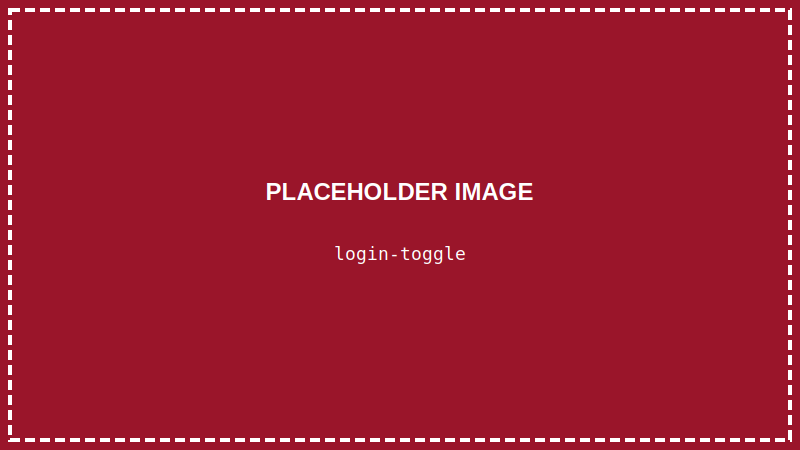
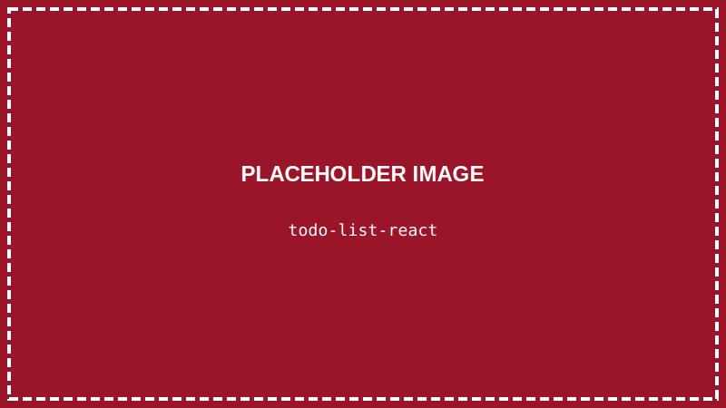

<details>
<summary>💡 AIに質問するときはここをクリック</summary>

ChatGPTやClaudeなどのAIに質問するときは、以下をコピーして最初に貼り付けてね！

```
【TypeScript講座 学習状況】
現在地: 第21回「条件によって表示を変えよう」

■ 学習済みの内容:
- VSCode、ターミナル、Node.js 24 LTS
- HTML/CSSの基本、Flexbox
- TypeScriptの基礎（変数、型、if文、for文、関数、配列、オブジェクト）
- DOM操作、イベント処理
- React:
  - Viteでプロジェクト作成
  - コンポーネント
  - JSX
  - props（親→子のデータ渡し）
  - useState（状態管理）
- 【作品①】自己紹介ページ
- 【作品②】じゃんけんゲーム
- 【作品③】クイズゲーム
- Reactカウンター

■ まだ習っていない内容:
特になし（基本は学習済み）

上記の学習状況を踏まえて、初心者にも分かるように答えてください。

【質問】
ここに質問を書いてね
```

</details>

> **この回で学ぶこと**
> - 条件によって表示を切り替える方法
> - 配列をリストとして表示する方法
> - key属性の意味と使い方

---

## はじめに

前回までで、propsとstateを学びました。

今回は、さらに実践的なテクニックを2つ学びます：

1. **条件付きレンダリング** - 状態によって表示を切り替える
2. **リスト表示** - 配列のデータをまとめて表示する

---

## STEP 1: プロジェクトを開く

### 1-1. VSCodeを起動する

デスクトップのVSCodeアイコンをダブルクリックして、VSCodeを起動します。

### 1-2. プロジェクトフォルダを開く

**「ファイル」→「フォルダーを開く」** から、デスクトップの `react-shindan` フォルダを開きます。

### 1-3. 開発サーバーを起動

ターミナルを開いて：

```
npm run dev
```

---

## STEP 2: 条件付きレンダリングとは？

「**条件付きレンダリング**」は、条件によって**表示する内容を変える**ことです。

例えば：
- ログイン中なら「ようこそ！」、未ログインなら「ログインしてください」
- データがあれば一覧表示、なければ「データがありません」

---

## STEP 3: && を使った条件付きレンダリング

最もシンプルな方法は `&&` を使うことです。

```tsx
{条件 && <表示する要素>}
```

条件が `true` のときだけ、要素が表示されます。

### 実際に試してみる

`src/App.tsx` を書き換えます：

```tsx
import { useState } from "react";

function App() {
    const [showMessage, setShowMessage] = useState(false);

    return (
        <div style={{ padding: "20px" }}>
            <h1>条件付きレンダリング</h1>

            <button
                onClick={() => setShowMessage(!showMessage)}
                style={{
                    padding: "10px 20px",
                    fontSize: "16px",
                    marginBottom: "20px"
                }}
            >
                {showMessage ? "メッセージを隠す" : "メッセージを表示"}
            </button>

            {/* showMessageがtrueのときだけ表示 */}
            {showMessage && (
                <div style={{
                    padding: "20px",
                    backgroundColor: "#dbeafe",
                    borderRadius: "8px"
                }}>
                    <p>こんにちは！これは条件付きで表示されるメッセージです。</p>
                </div>
            )}
        </div>
    );
}

export default App;
```

**`Ctrl + S`** で保存して確認！


ボタンを押すと、メッセージの表示/非表示が切り替わります。

---

## STEP 4: 三項演算子を使う

「Aの場合はX、Bの場合はY」のように、**2つの表示を切り替える**ときは三項演算子を使います。

```tsx
{条件 ? <trueの場合> : <falseの場合>}
```

```tsx
import { useState } from "react";

function App() {
    const [isLoggedIn, setIsLoggedIn] = useState(false);

    return (
        <div style={{ padding: "20px" }}>
            <h1>ログイン状態</h1>

            {/* ログイン状態によって表示を切り替え */}
            {isLoggedIn ? (
                <div style={{
                    padding: "20px",
                    backgroundColor: "#dcfce7",
                    borderRadius: "8px",
                    marginBottom: "20px"
                }}>
                    <p>ようこそ、山田さん！</p>
                </div>
            ) : (
                <div style={{
                    padding: "20px",
                    backgroundColor: "#fee2e2",
                    borderRadius: "8px",
                    marginBottom: "20px"
                }}>
                    <p>ログインしてください</p>
                </div>
            )}

            <button
                onClick={() => setIsLoggedIn(!isLoggedIn)}
                style={{
                    padding: "10px 20px",
                    fontSize: "16px",
                    backgroundColor: isLoggedIn ? "#ef4444" : "#22c55e",
                    color: "white",
                    border: "none",
                    borderRadius: "8px",
                    cursor: "pointer"
                }}
            >
                {isLoggedIn ? "ログアウト" : "ログイン"}
            </button>
        </div>
    );
}

export default App;
```

**`Ctrl + S`** で保存！



---

## STEP 5: リスト表示とは？

「**リスト表示**」は、配列のデータを**繰り返し表示**することです。

```tsx
// こんなデータがあるとき
const fruits = ["りんご", "バナナ", "オレンジ"];

// こう表示したい
// - りんご
// - バナナ
// - オレンジ
```

---

## STEP 6: map()でリスト表示する

配列の `map()` メソッドを使って、各要素をJSXに変換します。

```tsx
function App() {
    const fruits = ["りんご", "バナナ", "オレンジ", "ぶどう", "メロン"];

    return (
        <div style={{ padding: "20px" }}>
            <h1>フルーツリスト</h1>

            <ul>
                {fruits.map((fruit, index) => (
                    <li key={index}>{fruit}</li>
                ))}
            </ul>
        </div>
    );
}

export default App;
```

**`Ctrl + S`** で保存！


### map()の仕組み

```tsx
{fruits.map((fruit, index) => (
    <li key={index}>{fruit}</li>
))}
```

1. `fruits.map()` で配列の各要素をループ
2. `(fruit, index)` で各要素と番号を受け取る
3. `<li>` を返す
4. `key={index}` で各要素に一意の識別子をつける

---

## STEP 7: key属性について

Reactでリストを表示するとき、**key属性が必須**です。

```tsx
// ✅ keyをつける
{items.map((item, index) => (
    <div key={index}>{item}</div>
))}

// ❌ keyがないとワーニングが出る
{items.map((item) => (
    <div>{item}</div>
))}
```

### なぜkeyが必要？

Reactは画面を効率よく更新するために、「どの要素が変わったか」を判断する必要があります。

`key` はその判断に使われる「名札」のようなものです。

### keyに使う値

| 状況 | 使う値 |
|-----|------|
| データにIDがある | `key={item.id}` |
| IDがない | `key={index}`（インデックス） |

> **💡 ベストプラクティス**
> 可能であれば、`index` よりも**一意のID**を使いましょう。
> データベースからのデータには大抵IDがあります。

---

## STEP 8: 実践 - ToDoリスト風の表示

条件付きレンダリングとリスト表示を組み合わせてみましょう。

```tsx
import { useState } from "react";

type Task = {
    id: number;
    text: string;
    completed: boolean;
};

function App() {
    const [tasks, setTasks] = useState<Task[]>([
        { id: 1, text: "TypeScriptを学ぶ", completed: true },
        { id: 2, text: "Reactを学ぶ", completed: true },
        { id: 3, text: "診断ゲームを作る", completed: false },
        { id: 4, text: "ポートフォリオを作る", completed: false },
    ]);

    // タスクの完了状態を切り替え
    const toggleTask = (id: number) => {
        setTasks(tasks.map(task =>
            task.id === id
                ? { ...task, completed: !task.completed }
                : task
        ));
    };

    // 完了数を計算
    const completedCount = tasks.filter(task => task.completed).length;

    return (
        <div style={{
            padding: "20px",
            maxWidth: "500px",
            margin: "0 auto"
        }}>
            <h1>学習タスク</h1>

            {/* 進捗表示 */}
            <p style={{ color: "#64748b" }}>
                {completedCount} / {tasks.length} 完了
            </p>

            {/* タスクリスト */}
            <div style={{ display: "flex", flexDirection: "column", gap: "10px" }}>
                {tasks.map(task => (
                    <div
                        key={task.id}
                        onClick={() => toggleTask(task.id)}
                        style={{
                            padding: "15px",
                            backgroundColor: task.completed ? "#dcfce7" : "white",
                            border: "1px solid #e2e8f0",
                            borderRadius: "8px",
                            cursor: "pointer",
                            display: "flex",
                            alignItems: "center",
                            gap: "10px"
                        }}
                    >
                        {/* チェックマーク */}
                        <span style={{
                            width: "24px",
                            height: "24px",
                            borderRadius: "50%",
                            border: "2px solid",
                            borderColor: task.completed ? "#22c55e" : "#cbd5e1",
                            backgroundColor: task.completed ? "#22c55e" : "white",
                            display: "flex",
                            alignItems: "center",
                            justifyContent: "center",
                            color: "white",
                            fontSize: "14px"
                        }}>
                            {task.completed && "✓"}
                        </span>

                        {/* タスク名 */}
                        <span style={{
                            textDecoration: task.completed ? "line-through" : "none",
                            color: task.completed ? "#94a3b8" : "#334155"
                        }}>
                            {task.text}
                        </span>
                    </div>
                ))}
            </div>

            {/* 全部完了したら表示 */}
            {completedCount === tasks.length && (
                <div style={{
                    marginTop: "20px",
                    padding: "20px",
                    backgroundColor: "#fef3c7",
                    borderRadius: "8px",
                    textAlign: "center"
                }}>
                    🎉 すべてのタスクが完了しました！
                </div>
            )}
        </div>
    );
}

export default App;
```

**`Ctrl + S`** で保存！



タスクをクリックすると完了/未完了が切り替わり、全部完了するとメッセージが表示されます！

---

## STEP 9: カードリストを作る

もう一つの例として、カードのリストを作ってみましょう。

```tsx
type Product = {
    id: number;
    name: string;
    price: number;
    image: string;
    inStock: boolean;
};

const products: Product[] = [
    { id: 1, name: "TypeScript入門", price: 2800, image: "📘", inStock: true },
    { id: 2, name: "React実践", price: 3200, image: "📗", inStock: true },
    { id: 3, name: "Node.js入門", price: 2500, image: "📙", inStock: false },
    { id: 4, name: "CSS設計", price: 2200, image: "📕", inStock: true },
];

// 商品カードコンポーネント
function ProductCard({ product }: { product: Product }) {
    return (
        <div style={{
            backgroundColor: "white",
            borderRadius: "12px",
            padding: "20px",
            boxShadow: "0 2px 8px rgba(0,0,0,0.1)",
            opacity: product.inStock ? 1 : 0.5
        }}>
            <div style={{ fontSize: "48px", textAlign: "center", marginBottom: "10px" }}>
                {product.image}
            </div>
            <h3 style={{ margin: "0 0 8px 0" }}>{product.name}</h3>
            <p style={{ color: "#3b82f6", fontWeight: "bold", margin: "0 0 10px 0" }}>
                ¥{product.price.toLocaleString()}
            </p>

            {/* 在庫状況によって表示を変える */}
            {product.inStock ? (
                <button style={{
                    width: "100%",
                    padding: "10px",
                    backgroundColor: "#3b82f6",
                    color: "white",
                    border: "none",
                    borderRadius: "6px",
                    cursor: "pointer"
                }}>
                    カートに追加
                </button>
            ) : (
                <p style={{
                    textAlign: "center",
                    color: "#ef4444",
                    margin: 0
                }}>
                    在庫切れ
                </p>
            )}
        </div>
    );
}

function App() {
    return (
        <div style={{
            padding: "20px",
            backgroundColor: "#f1f5f9",
            minHeight: "100vh"
        }}>
            <h1 style={{ textAlign: "center" }}>書籍一覧</h1>

            <div style={{
                display: "grid",
                gridTemplateColumns: "repeat(auto-fill, minmax(200px, 1fr))",
                gap: "20px",
                maxWidth: "900px",
                margin: "0 auto"
            }}>
                {products.map(product => (
                    <ProductCard key={product.id} product={product} />
                ))}
            </div>
        </div>
    );
}

export default App;
```

**`Ctrl + S`** で保存！


---

## まとめ

この回でやったこと：

- ✅ `&&` で条件付き表示（trueの時だけ表示）
- ✅ 三項演算子で2択の表示切り替え
- ✅ `map()` で配列をリスト表示
- ✅ `key` 属性で要素を識別

---

## 次回予告

次回はいよいよ最終回「**診断ゲームを完成させよう**」です！

これまで学んだすべて（コンポーネント、props、state、条件付きレンダリング、リスト表示）を組み合わせて、診断ゲームを完成させます！

---

## 練習問題（やってみよう）

1. ToDoリストに「すべて完了」ボタンを追加して、一括で完了にできるようにしてみよう
2. 商品リストに「在庫ありのみ表示」フィルター機能を追加してみよう
3. タスクの追加機能（入力フォーム + 追加ボタン）を実装してみよう

保存（`Ctrl + S`）すると自動で更新されます！
