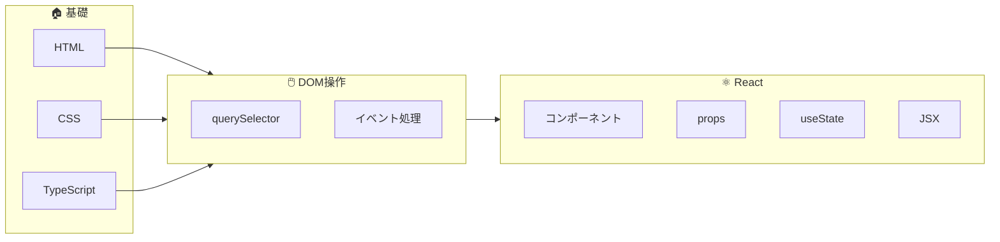
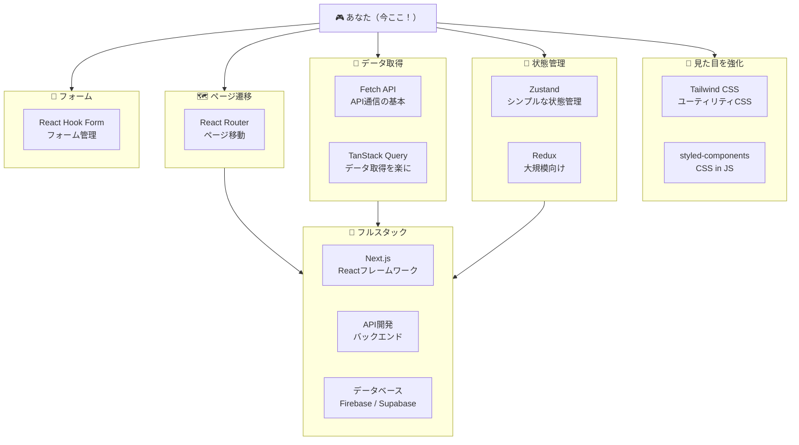
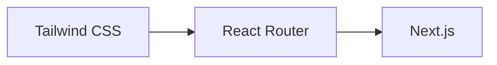
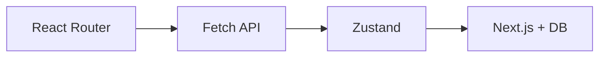
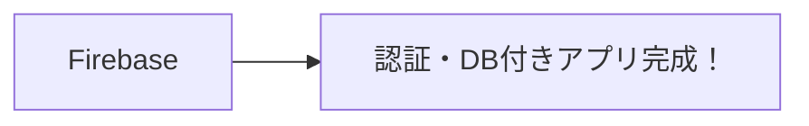

> **この回で学ぶこと**
> - この講座で身につけたスキル
> - これから学ぶべき技術のロードマップ
> - おすすめの学習リソース

---

## おめでとうございます！

**22回の講座、お疲れ様でした！**

プログラミングは、最初は難しく感じたかもしれません。
でも、一歩ずつ進んで、ここまで来ました。

診断ゲームを完成させたあなたは、もう「プログラミング初心者」ではありません！

---

## この講座で身につけたスキル

これらは、Webフロントエンド開発の**土台**となるスキルです。

---

## スキルツリー：これから何を学ぶ？

ゲームのスキルツリーのように、次に学ぶ技術を見てみましょう。

**どのルートから進んでもOKです！** 興味のあるものから始めましょう。

---

## 各スキルの解説

### 🎨 見た目を強化

| 技術 | 難易度 | 説明 |
|------|--------|------|
| **Tailwind CSS** | ⭐ | クラス名だけでスタイルを当てる。超人気 |
| **styled-components** | ⭐⭐ | JSの中にCSSを書く方法 |

**おすすめ**: まずは **Tailwind CSS** から。使っている人が多く、情報も豊富です。

### 🗺️ ページ遷移

| 技術 | 難易度 | 説明 |
|------|--------|------|
| **React Router** | ⭐⭐ | 複数ページのアプリを作れる |

診断ゲームは1ページでしたが、実際のアプリは複数ページあります。
「/about」「/contact」のようなURL遷移を実現します。

### 📡 データ取得

| 技術 | 難易度 | 説明 |
|------|--------|------|
| **Fetch API** | ⭐⭐ | ブラウザ標準のAPI通信 |
| **TanStack Query** | ⭐⭐⭐ | データ取得を便利にするライブラリ |

天気予報APIやニュースAPIなど、外部のデータを取得して表示できます。

### 🧠 状態管理

| 技術 | 難易度 | 説明 |
|------|--------|------|
| **Zustand** | ⭐⭐ | シンプルで学びやすい |
| **Redux** | ⭐⭐⭐⭐ | 大規模アプリ向け。学習コスト高め |

`useState` だけでは管理しきれない、アプリ全体の状態を管理します。
**Zustand** は簡単なのでおすすめです。

### 📝 フォーム

| 技術 | 難易度 | 説明 |
|------|--------|------|
| **React Hook Form** | ⭐⭐ | フォームのバリデーションなどを簡単に |

お問い合わせフォームや会員登録フォームなど、入力値の検証が必要な場面で便利です。

### 🚀 フルスタック

| 技術 | 難易度 | 説明 |
|------|--------|------|
| **Next.js** | ⭐⭐⭐ | Reactの上位互換。ルーティング等が標準搭載 |
| **Firebase** | ⭐⭐ | Googleのバックエンドサービス。認証やDB |
| **Supabase** | ⭐⭐ | オープンソース版Firebase |

本格的なWebアプリを作るならこのあたりが必要になります。

---

## おすすめの学習ルート

### ルートA: Webサイト制作コース

ポートフォリオサイトやブログを作りたい人向け。

### ルートB: Webアプリ開発コース

ToDoアプリや本格的なWebサービスを作りたい人向け。

### ルートC: とりあえず動くもの作りたいコース

最短でバックエンド付きのアプリを作りたい人向け。

---

## 学習リソース

### 公式ドキュメント（無料）
- **React公式** - https://ja.react.dev/learn
- **TypeScript公式** - https://www.typescriptlang.org/ja/
- **Next.js公式** - https://nextjs.org/docs
- **Tailwind CSS公式** - https://tailwindcss.com/docs

### 学習サイト（一部有料）
- **Progate** - https://prog-8.com/
- **ドットインストール** - https://dotinstall.com/
- **Udemy** - https://www.udemy.com/

### 作って学ぶ
- **ToDoアプリ** - CRUDの基本を学べる
- **天気予報アプリ** - API通信を学べる
- **ブログ** - CMSやマークダウンを学べる
- **ECサイト** - 状態管理・認証を学べる

---

## 最後に

**ここまで学んだあなたなら、きっと次のステップも踏み出せます。**

プログラミングは「できた！」の積み重ねです。

小さなアプリでいいので、何か作ってみてください。
作る過程で、必要な技術は自然と身についていきます。

**これからもプログラミングを楽しんでください！** 🎉

---

## この講座について

何かわからないことがあったら、いつでもこの講座に戻ってきてください。

また、AIに質問するときは各回の「💡 AIに質問するときはここをクリック」を活用してください。学習状況を伝えることで、より適切な回答が得られます。

---

**お疲れ様でした！**
