> **この回で学ぶこと**
> - この講座で身につけたスキル
> - Claude Codeでバイブコーディング
> - Git / GitHubの基本
> - これから学ぶべき技術のロードマップ

---

## おめでとうございます！

**22回の講座、お疲れ様でした！**

プログラミングは、最初は難しく感じたかもしれません。
でも、一歩ずつ進んで、ここまで来ました。

診断ゲームを完成させたあなたは、もう「プログラミング初心者」ではありません！

---

## この講座で身につけたスキル

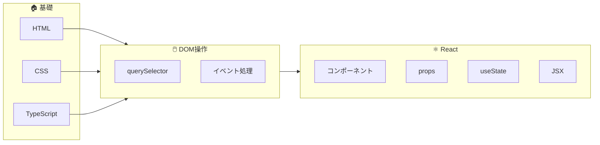

これらは、Web開発の**土台**となるスキルです。

---

## 🤖 まずはClaude Codeを使ってみよう

**次に学ぶ技術を決める前に、まずこれを試してほしい！**

この講座で学んだ知識があれば、**AIと一緒にコードを書く「バイブコーディング」** ができるようになります。

### Claude Codeとは？

Claude Code は、ターミナルで動くAIコーディングアシスタントです。

- 「こういうアプリ作って」と伝えるだけでコードを生成
- エラーが出たら自動で修正
- ファイルの作成・編集も全部やってくれる

```
# インストール
npm install -g @anthropic-ai/claude-code

# 起動
claude
```

### なぜ今Claude Codeなのか？

この講座で身につけた知識が、**AIとの会話で活きる**からです。

| あなたの知識 | AIへの指示例 |
|-------------|-------------|
| HTML/CSS | 「ヘッダーとフッターのあるレイアウトで」 |
| TypeScript | 「型は厳密につけて」 |
| React | 「useStateで状態管理して」「コンポーネントに分けて」 |
| props | 「propsでデータを渡す形にして」 |

知識がないと「なんかいい感じに作って」としか言えません。
でもあなたは「Reactで、useStateを使って、コンポーネントに分けて」と具体的に指示できます。

### バイブコーディングの流れ

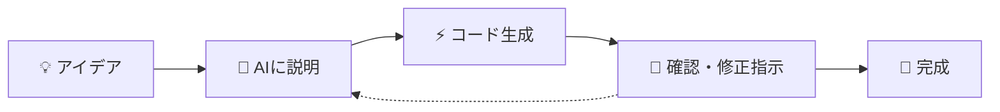

1. **作りたいものを説明する**（日本語でOK）
2. **AIがコードを生成**
3. **動かしてみて、気になる点を伝える**
4. **AIが修正** → 繰り返し

### 試してみよう

Claude Codeを起動して、こう言ってみてください：

> Reactでシンプルなカウンターアプリを作って。
> ボタンを押すと数字が増減する。
> Tailwind CSSでスタイリングして。

あなたの知識があれば、生成されたコードが「何をしているか」わかるはずです。
わからない部分があれば「この部分を説明して」と聞けばOK！

---

## 📝 Git / GitHubを覚えよう

**プログラミングを続けるなら、Gitは必須スキルです。**

### Gitとは？

コードの「変更履歴」を管理するツールです。

- いつ、誰が、何を変更したか記録
- 失敗しても前の状態に戻せる
- チーム開発で必須

### GitHubとは？

Gitのデータをインターネット上に保存・共有するサービスです。

- コードのバックアップ
- ポートフォリオとして公開
- チームでの共同作業

### 最低限覚えるコマンド

```bash
# 変更を記録する
git add .
git commit -m "変更内容のメモ"

# GitHubにアップロード
git push

# GitHubから最新を取得
git pull
```

### GitHubアカウントを作ろう

1. https://github.com にアクセス
2. 「Sign up」でアカウント作成
3. 自分のコードを公開してポートフォリオに！

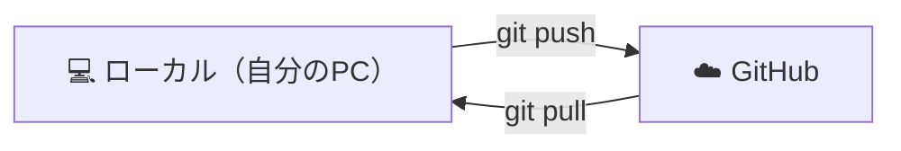

**Claude Codeを使うときも**、Gitで変更を管理すると安心です。
AIが書いたコードが気に入らなければ、すぐに元に戻せます。

---

## 全体マップ：Web開発の世界

Web開発は大きく3つの領域に分かれます。

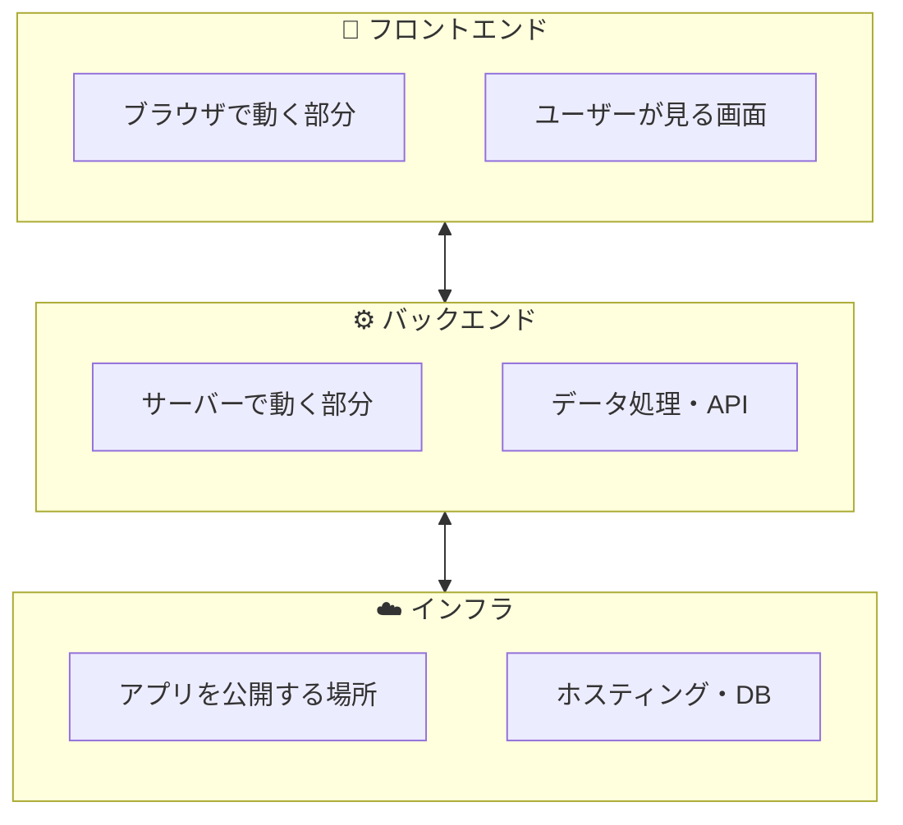

この講座では**フロントエンド**を学びました。
次は他の領域にも挑戦してみましょう！

---

## スキルツリー：これから何を学ぶ？

ゲームのスキルツリーのように、次に学ぶ技術を見てみましょう。

**どのルートから進んでもOKです！** 興味のあるものから始めましょう。

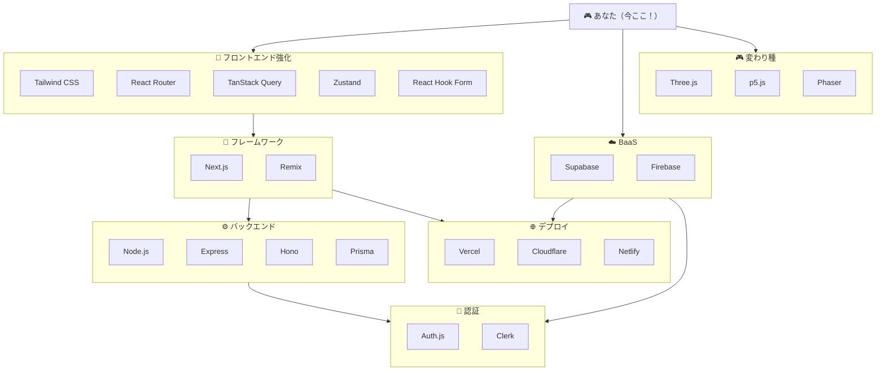

---

## 🎨 フロントエンド強化

今の知識をさらに深める技術です。

| 技術 | 難易度 | 説明 |
|------|--------|------|
| **Tailwind CSS** | ⭐ | クラス名だけでスタイル。今一番人気 |
| **shadcn/ui** | ⭐ | コピペで使える美しいUIコンポーネント集 |
| **React Router** | ⭐⭐ | 複数ページのアプリを作る |
| **TanStack Query** | ⭐⭐ | API通信を簡単・高速に |
| **Zustand** | ⭐⭐ | シンプルな状態管理 |
| **React Hook Form** | ⭐⭐ | フォームのバリデーション |

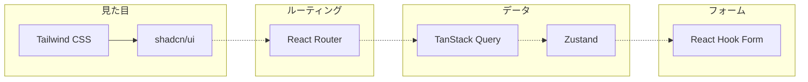

**おすすめ順**: Tailwind → shadcn/ui → React Router

---

## 🚀 フレームワーク

Reactをさらに便利にしたフレームワークです。

| 技術 | 難易度 | 説明 |
|------|--------|------|
| **Next.js** | ⭐⭐⭐ | React公式推奨。ルーティング・SSR標準搭載 |
| **Remix** | ⭐⭐⭐ | Web標準重視。フォーム処理が得意 |
| **Astro** | ⭐⭐ | コンテンツ重視。ブログやドキュメントサイトに最適 |

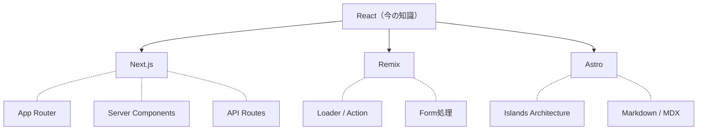

**おすすめ**: **Next.js** が圧倒的に人気。**Astro** はブログや技術ドキュメントに最適（この講座サイトもAstro製！）。

---

## ⚙️ バックエンド（サーバーサイド）

自分でAPIを作る技術です。

| 技術 | 難易度 | 説明 |
|------|--------|------|
| **Node.js** | ⭐⭐ | サーバーでJavaScript/TypeScriptを動かす |
| **Express** | ⭐⭐ | Node.js用Webフレームワークの定番 |
| **Hono** | ⭐⭐ | 軽量・高速。Cloudflare Workersと相性◎ |
| **Prisma** | ⭐⭐⭐ | データベースを簡単に扱えるORM |

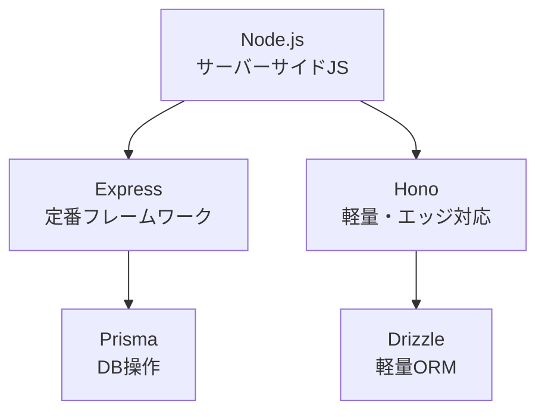

**おすすめ**: Cloudflareを使うなら **Hono**、それ以外は **Express**

---

## ☁️ BaaS（Backend as a Service）

バックエンドを自分で作らなくても使えるサービスです。

| サービス | 難易度 | 説明 |
|----------|--------|------|
| **Supabase** | ⭐⭐ | PostgreSQL + 認証 + ストレージ。オープンソース |
| **Firebase** | ⭐⭐ | Google製。リアルタイムDB・認証・ホスティング |

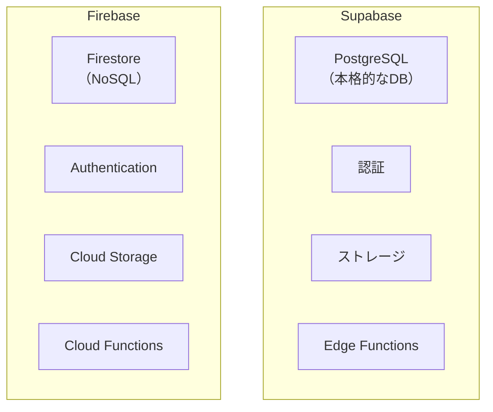

**どっちを選ぶ？**
- **Supabase**: SQLを学びたい、本格的なDB構造を作りたい
- **Firebase**: 手軽に始めたい、リアルタイム同期が必要

---

## 🌐 デプロイ（公開）

作ったアプリを世界に公開する場所です。

| サービス | 難易度 | 説明 |
|----------|--------|------|
| **Vercel** | ⭐ | Next.js開発元。デプロイ最簡単 |
| **Cloudflare Pages** | ⭐ | 無料枠が太っ腹。高速 |
| **Netlify** | ⭐ | 静的サイトに強い |

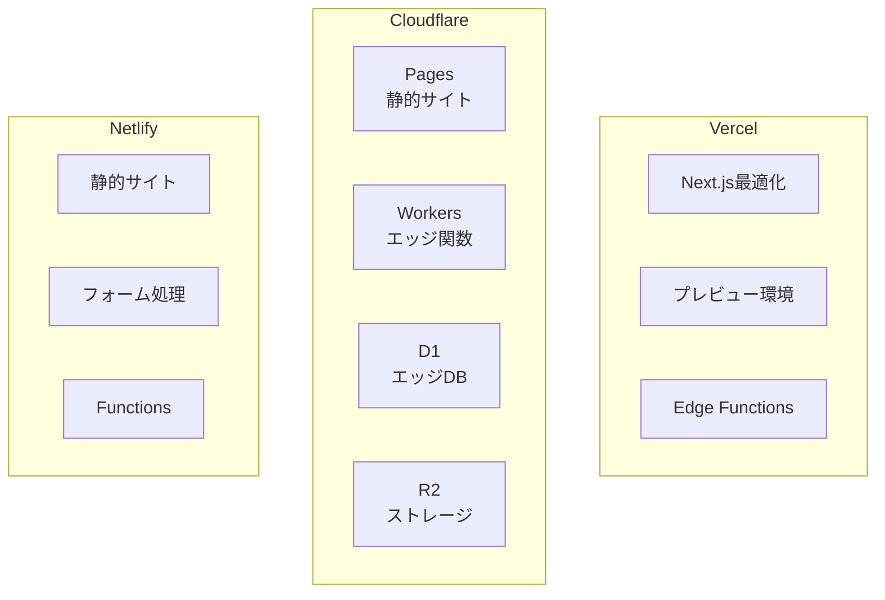

**おすすめ**:
- Next.jsを使うなら → **Vercel**
- 無料で色々やりたい → **Cloudflare**
- シンプルに公開したい → **Netlify**

---

## 🔐 認証

ログイン機能を実装する技術です。

| 技術 | 難易度 | 説明 |
|------|--------|------|
| **Auth.js** | ⭐⭐⭐ | 旧NextAuth.js。様々なプロバイダ対応 |
| **Clerk** | ⭐⭐ | UI付きで簡単。無料枠あり |
| **Supabase Auth** | ⭐⭐ | Supabase組み込み認証 |
| **Firebase Auth** | ⭐⭐ | Firebase組み込み認証 |

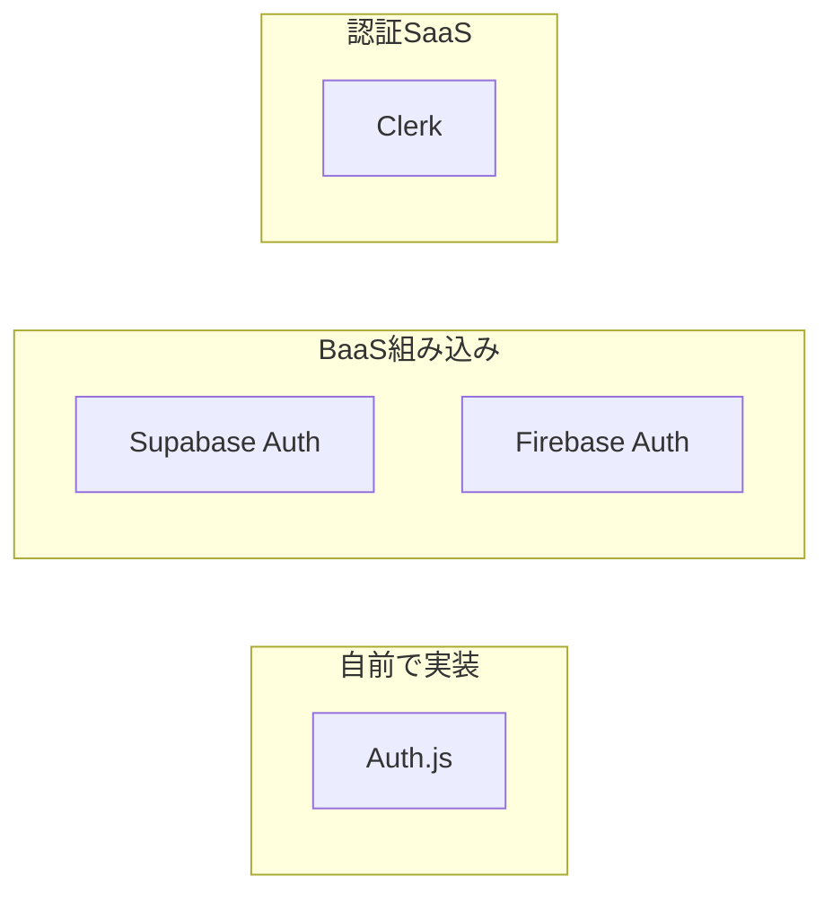

**おすすめ**: Supabase/Firebaseを使うならその認証機能、それ以外は **Clerk** が簡単

---

## 🎮 ちょっと変わり種

普通のWebアプリ開発とは違う、ユニークな方向性もあります。

| 技術 | 難易度 | 説明 |
|------|--------|------|
| **Three.js** | ⭐⭐⭐ | ブラウザで3Dグラフィックス。ゲームやビジュアルアート |
| **React Three Fiber** | ⭐⭐⭐ | Three.jsをReactで書ける |
| **p5.js** | ⭐⭐ | クリエイティブコーディング。アート作品向け |
| **GSAP** | ⭐⭐ | 本格的なアニメーションライブラリ |
| **Phaser** | ⭐⭐⭐ | ブラウザゲーム開発フレームワーク |

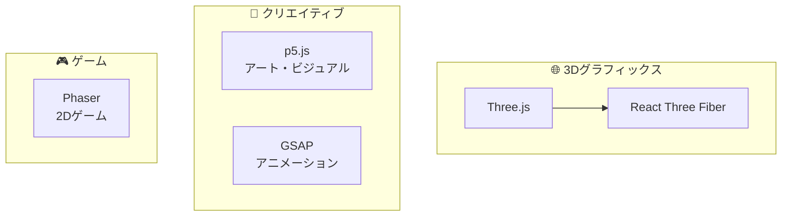

**こんな人におすすめ**:
- ポートフォリオサイトを派手にしたい → **Three.js / GSAP**
- アート作品を作りたい → **p5.js**
- ブラウザゲームを作りたい → **Phaser**

---

## 🗺️ おすすめの学習ルート

### ルートA: フロントエンド特化コース

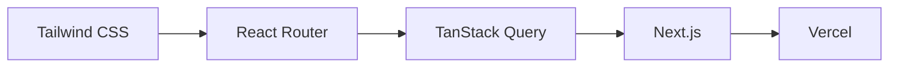

フロントエンドを極めたい人向け。まずはここから始めるのがおすすめ。

### ルートB: フルスタック最短コース

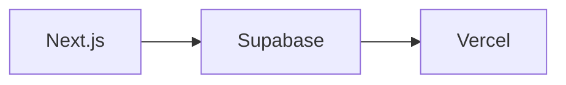

最短で「認証付きWebアプリ」を作りたい人向け。

### ルートC: バックエンド挑戦コース

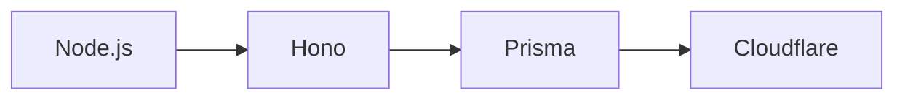

サーバーサイドもしっかり学びたい人向け。

### ルートD: とにかく公開したいコース

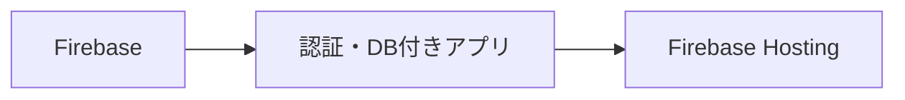

最短でアプリを公開したい人向け。全部Googleのサービスで完結。

### ルートE: クリエイティブコース

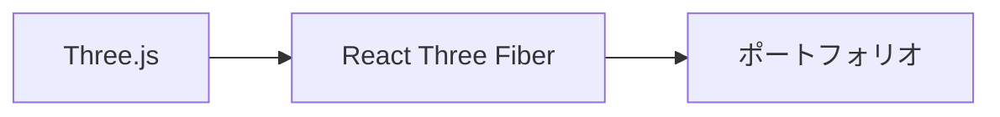

3Dやビジュアル表現に興味がある人向け。ポートフォリオで差をつけたい人にも。

---

## 技術選定チートシート

| やりたいこと | おすすめ技術 |
|-------------|-------------|
| スタイルを効率的に書きたい | **Tailwind CSS** |
| 複数ページのアプリを作りたい | **Next.js** or **React Router** |
| APIからデータを取得したい | **TanStack Query** |
| ログイン機能をつけたい | **Supabase** or **Clerk** |
| データベースを使いたい | **Supabase** or **Firebase** |
| アプリを公開したい | **Vercel** or **Cloudflare** |
| 自分でAPIを作りたい | **Hono** or **Express** |
| 3Dグラフィックスを作りたい | **Three.js** |
| ブラウザゲームを作りたい | **Phaser** |
| かっこいいアニメーションを作りたい | **GSAP** |

---

## 学習リソース

### 公式ドキュメント（無料）
- **React** - https://ja.react.dev/learn
- **Next.js** - https://nextjs.org/docs
- **Tailwind CSS** - https://tailwindcss.com/docs
- **Supabase** - https://supabase.com/docs
- **Cloudflare** - https://developers.cloudflare.com/

### 学習サイト
- **Progate** - https://prog-8.com/
- **ドットインストール** - https://dotinstall.com/
- **Udemy** - https://www.udemy.com/
- **Zenn** - https://zenn.dev/ （技術記事）

### 作って学ぶプロジェクト例
| プロジェクト | 学べること |
|-------------|-----------|
| **ToDoアプリ** | CRUD操作、状態管理 |
| **ブログ** | マークダウン、SSG |
| **天気予報アプリ** | API通信、データ表示 |
| **認証付きメモアプリ** | 認証、データベース |
| **ECサイト** | カート機能、決済連携 |

---

## 最後に

**ここまで学んだあなたなら、きっと次のステップも踏み出せます。**

プログラミングは「できた！」の積み重ねです。

小さなアプリでいいので、何か作ってみてください。
作る過程で、必要な技術は自然と身についていきます。

**これからもプログラミングを楽しんでください！** 🎉

---

## この講座について

何かわからないことがあったら、いつでもこの講座に戻ってきてください。

また、AIに質問するときは各回の「💡 AIに質問するときはここをクリック」を活用してください。学習状況を伝えることで、より適切な回答が得られます。

---

**お疲れ様でした！**
